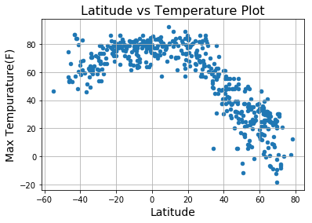
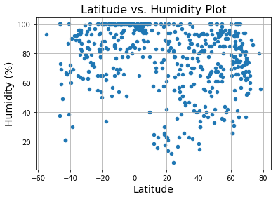
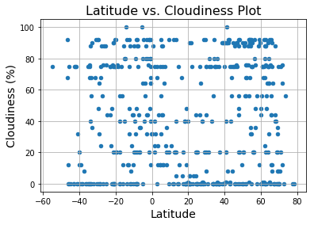
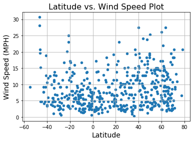

```python
#Dependancies 
import pandas as pd
import json
import pprint
import requests
from random import *
from citipy import citipy
import time
import matplotlib.pyplot as plt
from config import api_key
```


```python


#to store data in list in order to zip into tuple for later use
city_list=[]
country_code=[]
#make loop so that 500 cities and country codes are stored 
while len(city_list) <=1000:
    #random latitude and longitude 
    latitude =randint(-90.00,90.00)
    longitude =randint(-180.00, 180.00)
    # get citipy info for nearest city name and country code add to dictionary 
    city=citipy.nearest_city(latitude, longitude)
    if city.city_name not in city_list:
        city_list.append(city.city_name)
        country_code.append(city.country_code)
    else:
        continue
#make tuple for later unpack with city name and country code to use in loop for API        

city_data=tuple(zip(city_list,country_code))

```


```python

#Make Lists for data that we need
Latitude=[]
Tempurature_F=[]
Humidity_Percent=[]
Cloudiness_Percent=[]
Wind_Speed_MPH=[]
Cities=[]
Countries=[]
Date=[]
#variables to hold city name and country code for api, counter to count how many data points generated per minute 
#slow loop down every 60 data points so that API doesn't freeze
#make variable for city name and city code, create counter for n and sets to parse data in 50 city chunk
city_name=""
country_code=""
n=1
set=1
print("Beginning Data Retrieval\n-----------------------------")
#loop tupel in order to unpack and parse through api loop to recieve data; put data into lists
for a,b in city_data:
    city_name=a.capitalize()
    city_name=city_name.replace(" ", "")
    country_code=b
    url=f"http://api.openweathermap.org/data/2.5/weather?q={city_name},{country_code}&units=imperial"
    response=requests.get(url+api_key)
    response_list=requests.get(url+api_key).json()
    try:
            Latitude.append(response_list["coord"]["lat"])
            Tempurature_F.append(response_list["main"]["temp_max"])
            Humidity_Percent.append(response_list["main"]["humidity"])
            Cloudiness_Percent.append(response_list["clouds"]["all"])
            Wind_Speed_MPH.append(response_list["wind"]["speed"])
            Cities.append(city_name)
            Countries.append(country_code)
            Date.append(response_list["dt"])
            print (f"Processing Record {n} of Set {set} | {city_name}\n {url}{api_key}")
            n=n+1
            if n==51:
             #add value to set and reset n
                set=set+1
                n=1
                #pause
                time.sleep(10)
                if set==11:
                    break
            
            
    except (KeyError):
         print("error")
           
    


```

    Beginning Data Retrieval
    -----------------------------
    Processing Record 1 of Set 1 | Bluff
     http://api.openweathermap.org/data/2.5/weather?q=Bluff,nz&units=imperial&APPID=7b19c47aad8b7a8160a41622a5667a66
    Processing Record 2 of Set 1 | Albany
     http://api.openweathermap.org/data/2.5/weather?q=Albany,au&units=imperial&APPID=7b19c47aad8b7a8160a41622a5667a66
    Processing Record 3 of Set 1 | Bredasdorp
     http://api.openweathermap.org/data/2.5/weather?q=Bredasdorp,za&units=imperial&APPID=7b19c47aad8b7a8160a41622a5667a66
    Processing Record 4 of Set 1 | Barrow
     http://api.openweathermap.org/data/2.5/weather?q=Barrow,us&units=imperial&APPID=7b19c47aad8b7a8160a41622a5667a66
    Processing Record 5 of Set 1 | Wasilla
     http://api.openweathermap.org/data/2.5/weather?q=Wasilla,us&units=imperial&APPID=7b19c47aad8b7a8160a41622a5667a66
    Processing Record 6 of Set 1 | Khatanga
     http://api.openweathermap.org/data/2.5/weather?q=Khatanga,ru&units=imperial&APPID=7b19c47aad8b7a8160a41622a5667a66
    Processing Record 7 of Set 1 | Energetik
     http://api.openweathermap.org/data/2.5/weather?q=Energetik,ru&units=imperial&APPID=7b19c47aad8b7a8160a41622a5667a66
    Processing Record 8 of Set 1 | Vaini
     http://api.openweathermap.org/data/2.5/weather?q=Vaini,to&units=imperial&APPID=7b19c47aad8b7a8160a41622a5667a66
    Processing Record 9 of Set 1 | Avarua
     http://api.openweathermap.org/data/2.5/weather?q=Avarua,ck&units=imperial&APPID=7b19c47aad8b7a8160a41622a5667a66
    Processing Record 10 of Set 1 | Mpongwe
     http://api.openweathermap.org/data/2.5/weather?q=Mpongwe,zm&units=imperial&APPID=7b19c47aad8b7a8160a41622a5667a66
    error
    Processing Record 11 of Set 1 | College
     http://api.openweathermap.org/data/2.5/weather?q=College,us&units=imperial&APPID=7b19c47aad8b7a8160a41622a5667a66
    error
    Processing Record 12 of Set 1 | Busselton
     http://api.openweathermap.org/data/2.5/weather?q=Busselton,au&units=imperial&APPID=7b19c47aad8b7a8160a41622a5667a66
    error
    error
    error
    error
    Processing Record 13 of Set 1 | Neiafu
     http://api.openweathermap.org/data/2.5/weather?q=Neiafu,to&units=imperial&APPID=7b19c47aad8b7a8160a41622a5667a66
    Processing Record 14 of Set 1 | Yellowknife
     http://api.openweathermap.org/data/2.5/weather?q=Yellowknife,ca&units=imperial&APPID=7b19c47aad8b7a8160a41622a5667a66
    error
    Processing Record 15 of Set 1 | Kavieng
     http://api.openweathermap.org/data/2.5/weather?q=Kavieng,pg&units=imperial&APPID=7b19c47aad8b7a8160a41622a5667a66
    Processing Record 16 of Set 1 | Mandalgovi
     http://api.openweathermap.org/data/2.5/weather?q=Mandalgovi,mn&units=imperial&APPID=7b19c47aad8b7a8160a41622a5667a66
    Processing Record 17 of Set 1 | Nampula
     http://api.openweathermap.org/data/2.5/weather?q=Nampula,mz&units=imperial&APPID=7b19c47aad8b7a8160a41622a5667a66
    Processing Record 18 of Set 1 | Businga
     http://api.openweathermap.org/data/2.5/weather?q=Businga,cd&units=imperial&APPID=7b19c47aad8b7a8160a41622a5667a66
    error
    error
    Processing Record 19 of Set 1 | Hofn
     http://api.openweathermap.org/data/2.5/weather?q=Hofn,is&units=imperial&APPID=7b19c47aad8b7a8160a41622a5667a66
    Processing Record 20 of Set 1 | Ushuaia
     http://api.openweathermap.org/data/2.5/weather?q=Ushuaia,ar&units=imperial&APPID=7b19c47aad8b7a8160a41622a5667a66
    Processing Record 21 of Set 1 | Ixtapa
     http://api.openweathermap.org/data/2.5/weather?q=Ixtapa,mx&units=imperial&APPID=7b19c47aad8b7a8160a41622a5667a66
    error
    Processing Record 22 of Set 1 | Aklavik
     http://api.openweathermap.org/data/2.5/weather?q=Aklavik,ca&units=imperial&APPID=7b19c47aad8b7a8160a41622a5667a66
    Processing Record 23 of Set 1 | Hobart
     http://api.openweathermap.org/data/2.5/weather?q=Hobart,au&units=imperial&APPID=7b19c47aad8b7a8160a41622a5667a66
    error
    error
    Processing Record 24 of Set 1 | Provideniya
     http://api.openweathermap.org/data/2.5/weather?q=Provideniya,ru&units=imperial&APPID=7b19c47aad8b7a8160a41622a5667a66
    Processing Record 25 of Set 1 | Kyabram
     http://api.openweathermap.org/data/2.5/weather?q=Kyabram,au&units=imperial&APPID=7b19c47aad8b7a8160a41622a5667a66
    Processing Record 26 of Set 1 | Kahului
     http://api.openweathermap.org/data/2.5/weather?q=Kahului,us&units=imperial&APPID=7b19c47aad8b7a8160a41622a5667a66
    error
    Processing Record 27 of Set 1 | Jamestown
     http://api.openweathermap.org/data/2.5/weather?q=Jamestown,sh&units=imperial&APPID=7b19c47aad8b7a8160a41622a5667a66
    error
    Processing Record 28 of Set 1 | Fairview
     http://api.openweathermap.org/data/2.5/weather?q=Fairview,ca&units=imperial&APPID=7b19c47aad8b7a8160a41622a5667a66
    error
    error
    Processing Record 29 of Set 1 | Naryan-mar
     http://api.openweathermap.org/data/2.5/weather?q=Naryan-mar,ru&units=imperial&APPID=7b19c47aad8b7a8160a41622a5667a66
    Processing Record 30 of Set 1 | Tooele
     http://api.openweathermap.org/data/2.5/weather?q=Tooele,us&units=imperial&APPID=7b19c47aad8b7a8160a41622a5667a66
    Processing Record 31 of Set 1 | Manzhouli
     http://api.openweathermap.org/data/2.5/weather?q=Manzhouli,cn&units=imperial&APPID=7b19c47aad8b7a8160a41622a5667a66
    Processing Record 32 of Set 1 | Springdale
     http://api.openweathermap.org/data/2.5/weather?q=Springdale,ca&units=imperial&APPID=7b19c47aad8b7a8160a41622a5667a66
    error
    error
    Processing Record 33 of Set 1 | Chokurdakh
     http://api.openweathermap.org/data/2.5/weather?q=Chokurdakh,ru&units=imperial&APPID=7b19c47aad8b7a8160a41622a5667a66
    Processing Record 34 of Set 1 | Komsomolskiy
     http://api.openweathermap.org/data/2.5/weather?q=Komsomolskiy,ru&units=imperial&APPID=7b19c47aad8b7a8160a41622a5667a66
    Processing Record 35 of Set 1 | Cabedelo
     http://api.openweathermap.org/data/2.5/weather?q=Cabedelo,br&units=imperial&APPID=7b19c47aad8b7a8160a41622a5667a66
    Processing Record 36 of Set 1 | Chuy
     http://api.openweathermap.org/data/2.5/weather?q=Chuy,uy&units=imperial&APPID=7b19c47aad8b7a8160a41622a5667a66
    Processing Record 37 of Set 1 | Saldanha
     http://api.openweathermap.org/data/2.5/weather?q=Saldanha,za&units=imperial&APPID=7b19c47aad8b7a8160a41622a5667a66
    Processing Record 38 of Set 1 | Hambantota
     http://api.openweathermap.org/data/2.5/weather?q=Hambantota,lk&units=imperial&APPID=7b19c47aad8b7a8160a41622a5667a66
    Processing Record 39 of Set 1 | Kapaa
     http://api.openweathermap.org/data/2.5/weather?q=Kapaa,us&units=imperial&APPID=7b19c47aad8b7a8160a41622a5667a66
    error
    Processing Record 40 of Set 1 | Ures
     http://api.openweathermap.org/data/2.5/weather?q=Ures,mx&units=imperial&APPID=7b19c47aad8b7a8160a41622a5667a66
    Processing Record 41 of Set 1 | Sernur
     http://api.openweathermap.org/data/2.5/weather?q=Sernur,ru&units=imperial&APPID=7b19c47aad8b7a8160a41622a5667a66
    Processing Record 42 of Set 1 | Rochegda
     http://api.openweathermap.org/data/2.5/weather?q=Rochegda,ru&units=imperial&APPID=7b19c47aad8b7a8160a41622a5667a66
    Processing Record 43 of Set 1 | Bethel
     http://api.openweathermap.org/data/2.5/weather?q=Bethel,us&units=imperial&APPID=7b19c47aad8b7a8160a41622a5667a66
    Processing Record 44 of Set 1 | Iquique
     http://api.openweathermap.org/data/2.5/weather?q=Iquique,cl&units=imperial&APPID=7b19c47aad8b7a8160a41622a5667a66
    Processing Record 45 of Set 1 | Rikitea
     http://api.openweathermap.org/data/2.5/weather?q=Rikitea,pf&units=imperial&APPID=7b19c47aad8b7a8160a41622a5667a66
    Processing Record 46 of Set 1 | Roebourne
     http://api.openweathermap.org/data/2.5/weather?q=Roebourne,au&units=imperial&APPID=7b19c47aad8b7a8160a41622a5667a66
    Processing Record 47 of Set 1 | Aasiaat
     http://api.openweathermap.org/data/2.5/weather?q=Aasiaat,gl&units=imperial&APPID=7b19c47aad8b7a8160a41622a5667a66
    Processing Record 48 of Set 1 | Ferrol
     http://api.openweathermap.org/data/2.5/weather?q=Ferrol,es&units=imperial&APPID=7b19c47aad8b7a8160a41622a5667a66
    error
    error
    Processing Record 49 of Set 1 | Jacmel
     http://api.openweathermap.org/data/2.5/weather?q=Jacmel,ht&units=imperial&APPID=7b19c47aad8b7a8160a41622a5667a66
    error
    Processing Record 50 of Set 1 | Zhigansk
     http://api.openweathermap.org/data/2.5/weather?q=Zhigansk,ru&units=imperial&APPID=7b19c47aad8b7a8160a41622a5667a66
    Processing Record 1 of Set 2 | Athabasca
     http://api.openweathermap.org/data/2.5/weather?q=Athabasca,ca&units=imperial&APPID=7b19c47aad8b7a8160a41622a5667a66
    error
    error
    Processing Record 2 of Set 2 | Tuktoyaktuk
     http://api.openweathermap.org/data/2.5/weather?q=Tuktoyaktuk,ca&units=imperial&APPID=7b19c47aad8b7a8160a41622a5667a66
    Processing Record 3 of Set 2 | Castro
     http://api.openweathermap.org/data/2.5/weather?q=Castro,cl&units=imperial&APPID=7b19c47aad8b7a8160a41622a5667a66
    Processing Record 4 of Set 2 | Hermanus
     http://api.openweathermap.org/data/2.5/weather?q=Hermanus,za&units=imperial&APPID=7b19c47aad8b7a8160a41622a5667a66
    Processing Record 5 of Set 2 | Naze
     http://api.openweathermap.org/data/2.5/weather?q=Naze,jp&units=imperial&APPID=7b19c47aad8b7a8160a41622a5667a66
    Processing Record 6 of Set 2 | Atuona
     http://api.openweathermap.org/data/2.5/weather?q=Atuona,pf&units=imperial&APPID=7b19c47aad8b7a8160a41622a5667a66
    error
    Processing Record 7 of Set 2 | Firminy
     http://api.openweathermap.org/data/2.5/weather?q=Firminy,fr&units=imperial&APPID=7b19c47aad8b7a8160a41622a5667a66
    Processing Record 8 of Set 2 | Hamilton
     http://api.openweathermap.org/data/2.5/weather?q=Hamilton,bm&units=imperial&APPID=7b19c47aad8b7a8160a41622a5667a66
    error
    Processing Record 9 of Set 2 | Daru
     http://api.openweathermap.org/data/2.5/weather?q=Daru,pg&units=imperial&APPID=7b19c47aad8b7a8160a41622a5667a66
    Processing Record 10 of Set 2 | Carnarvon
     http://api.openweathermap.org/data/2.5/weather?q=Carnarvon,au&units=imperial&APPID=7b19c47aad8b7a8160a41622a5667a66
    Processing Record 11 of Set 2 | Saskylakh
     http://api.openweathermap.org/data/2.5/weather?q=Saskylakh,ru&units=imperial&APPID=7b19c47aad8b7a8160a41622a5667a66
    Processing Record 12 of Set 2 | Verona
     http://api.openweathermap.org/data/2.5/weather?q=Verona,us&units=imperial&APPID=7b19c47aad8b7a8160a41622a5667a66
    Processing Record 13 of Set 2 | Kaitangata
     http://api.openweathermap.org/data/2.5/weather?q=Kaitangata,nz&units=imperial&APPID=7b19c47aad8b7a8160a41622a5667a66
    error
    error
    error
    error
    Processing Record 14 of Set 2 | Lebu
     http://api.openweathermap.org/data/2.5/weather?q=Lebu,cl&units=imperial&APPID=7b19c47aad8b7a8160a41622a5667a66
    Processing Record 15 of Set 2 | Yarega
     http://api.openweathermap.org/data/2.5/weather?q=Yarega,ru&units=imperial&APPID=7b19c47aad8b7a8160a41622a5667a66
    Processing Record 16 of Set 2 | Rawson
     http://api.openweathermap.org/data/2.5/weather?q=Rawson,ar&units=imperial&APPID=7b19c47aad8b7a8160a41622a5667a66
    error
    Processing Record 17 of Set 2 | Butaritari
     http://api.openweathermap.org/data/2.5/weather?q=Butaritari,ki&units=imperial&APPID=7b19c47aad8b7a8160a41622a5667a66
    Processing Record 18 of Set 2 | Severo-kurilsk
     http://api.openweathermap.org/data/2.5/weather?q=Severo-kurilsk,ru&units=imperial&APPID=7b19c47aad8b7a8160a41622a5667a66
    error
    error
    Processing Record 19 of Set 2 | Tiksi
     http://api.openweathermap.org/data/2.5/weather?q=Tiksi,ru&units=imperial&APPID=7b19c47aad8b7a8160a41622a5667a66
    error
    Processing Record 20 of Set 2 | Saint-philippe
     http://api.openweathermap.org/data/2.5/weather?q=Saint-philippe,re&units=imperial&APPID=7b19c47aad8b7a8160a41622a5667a66
    Processing Record 21 of Set 2 | Aksu
     http://api.openweathermap.org/data/2.5/weather?q=Aksu,cn&units=imperial&APPID=7b19c47aad8b7a8160a41622a5667a66
    Processing Record 22 of Set 2 | Dunedin
     http://api.openweathermap.org/data/2.5/weather?q=Dunedin,nz&units=imperial&APPID=7b19c47aad8b7a8160a41622a5667a66
    error
    Processing Record 23 of Set 2 | Miraflores
     http://api.openweathermap.org/data/2.5/weather?q=Miraflores,co&units=imperial&APPID=7b19c47aad8b7a8160a41622a5667a66
    Processing Record 24 of Set 2 | Hilo
     http://api.openweathermap.org/data/2.5/weather?q=Hilo,us&units=imperial&APPID=7b19c47aad8b7a8160a41622a5667a66
    Processing Record 25 of Set 2 | Sebastian
     http://api.openweathermap.org/data/2.5/weather?q=Sebastian,us&units=imperial&APPID=7b19c47aad8b7a8160a41622a5667a66
    error
    Processing Record 26 of Set 2 | Qaanaaq
     http://api.openweathermap.org/data/2.5/weather?q=Qaanaaq,gl&units=imperial&APPID=7b19c47aad8b7a8160a41622a5667a66
    Processing Record 27 of Set 2 | Paita
     http://api.openweathermap.org/data/2.5/weather?q=Paita,pe&units=imperial&APPID=7b19c47aad8b7a8160a41622a5667a66
    error
    Processing Record 28 of Set 2 | Ivnya
     http://api.openweathermap.org/data/2.5/weather?q=Ivnya,ru&units=imperial&APPID=7b19c47aad8b7a8160a41622a5667a66
    Processing Record 29 of Set 2 | Torbay
     http://api.openweathermap.org/data/2.5/weather?q=Torbay,ca&units=imperial&APPID=7b19c47aad8b7a8160a41622a5667a66
    Processing Record 30 of Set 2 | Harrismith
     http://api.openweathermap.org/data/2.5/weather?q=Harrismith,za&units=imperial&APPID=7b19c47aad8b7a8160a41622a5667a66
    error
    error
    Processing Record 31 of Set 2 | Fortuna
     http://api.openweathermap.org/data/2.5/weather?q=Fortuna,us&units=imperial&APPID=7b19c47aad8b7a8160a41622a5667a66
    Processing Record 32 of Set 2 | Bilma
     http://api.openweathermap.org/data/2.5/weather?q=Bilma,ne&units=imperial&APPID=7b19c47aad8b7a8160a41622a5667a66
    Processing Record 33 of Set 2 | Balikpapan
     http://api.openweathermap.org/data/2.5/weather?q=Balikpapan,id&units=imperial&APPID=7b19c47aad8b7a8160a41622a5667a66
    Processing Record 34 of Set 2 | Kodiak
     http://api.openweathermap.org/data/2.5/weather?q=Kodiak,us&units=imperial&APPID=7b19c47aad8b7a8160a41622a5667a66
    Processing Record 35 of Set 2 | Tasiilaq
     http://api.openweathermap.org/data/2.5/weather?q=Tasiilaq,gl&units=imperial&APPID=7b19c47aad8b7a8160a41622a5667a66
    error
    Processing Record 36 of Set 2 | Ayagoz
     http://api.openweathermap.org/data/2.5/weather?q=Ayagoz,kz&units=imperial&APPID=7b19c47aad8b7a8160a41622a5667a66
    error
    Processing Record 37 of Set 2 | Chiredzi
     http://api.openweathermap.org/data/2.5/weather?q=Chiredzi,zw&units=imperial&APPID=7b19c47aad8b7a8160a41622a5667a66
    Processing Record 38 of Set 2 | Uri
     http://api.openweathermap.org/data/2.5/weather?q=Uri,in&units=imperial&APPID=7b19c47aad8b7a8160a41622a5667a66
    Processing Record 39 of Set 2 | Cherskiy
     http://api.openweathermap.org/data/2.5/weather?q=Cherskiy,ru&units=imperial&APPID=7b19c47aad8b7a8160a41622a5667a66
    Processing Record 40 of Set 2 | Cidreira
     http://api.openweathermap.org/data/2.5/weather?q=Cidreira,br&units=imperial&APPID=7b19c47aad8b7a8160a41622a5667a66
    Processing Record 41 of Set 2 | Conakry
     http://api.openweathermap.org/data/2.5/weather?q=Conakry,gn&units=imperial&APPID=7b19c47aad8b7a8160a41622a5667a66
    Processing Record 42 of Set 2 | Talnakh
     http://api.openweathermap.org/data/2.5/weather?q=Talnakh,ru&units=imperial&APPID=7b19c47aad8b7a8160a41622a5667a66
    Processing Record 43 of Set 2 | Marica
     http://api.openweathermap.org/data/2.5/weather?q=Marica,br&units=imperial&APPID=7b19c47aad8b7a8160a41622a5667a66
    Processing Record 44 of Set 2 | Mareeba
     http://api.openweathermap.org/data/2.5/weather?q=Mareeba,au&units=imperial&APPID=7b19c47aad8b7a8160a41622a5667a66
    error
    Processing Record 45 of Set 2 | Kiruna
     http://api.openweathermap.org/data/2.5/weather?q=Kiruna,se&units=imperial&APPID=7b19c47aad8b7a8160a41622a5667a66
    Processing Record 46 of Set 2 | Villamontes
     http://api.openweathermap.org/data/2.5/weather?q=Villamontes,bo&units=imperial&APPID=7b19c47aad8b7a8160a41622a5667a66
    Processing Record 47 of Set 2 | Tomatlan
     http://api.openweathermap.org/data/2.5/weather?q=Tomatlan,mx&units=imperial&APPID=7b19c47aad8b7a8160a41622a5667a66
    Processing Record 48 of Set 2 | Mahibadhoo
     http://api.openweathermap.org/data/2.5/weather?q=Mahibadhoo,mv&units=imperial&APPID=7b19c47aad8b7a8160a41622a5667a66
    Processing Record 49 of Set 2 | Recodo
     http://api.openweathermap.org/data/2.5/weather?q=Recodo,ph&units=imperial&APPID=7b19c47aad8b7a8160a41622a5667a66
    error
    Processing Record 50 of Set 2 | Vorchdorf
     http://api.openweathermap.org/data/2.5/weather?q=Vorchdorf,at&units=imperial&APPID=7b19c47aad8b7a8160a41622a5667a66
    error
    Processing Record 1 of Set 3 | Portland
     http://api.openweathermap.org/data/2.5/weather?q=Portland,au&units=imperial&APPID=7b19c47aad8b7a8160a41622a5667a66
    error
    Processing Record 2 of Set 3 | Nyurba
     http://api.openweathermap.org/data/2.5/weather?q=Nyurba,ru&units=imperial&APPID=7b19c47aad8b7a8160a41622a5667a66
    Processing Record 3 of Set 3 | Upernavik
     http://api.openweathermap.org/data/2.5/weather?q=Upernavik,gl&units=imperial&APPID=7b19c47aad8b7a8160a41622a5667a66
    Processing Record 4 of Set 3 | Teguise
     http://api.openweathermap.org/data/2.5/weather?q=Teguise,es&units=imperial&APPID=7b19c47aad8b7a8160a41622a5667a66
    Processing Record 5 of Set 3 | Owando
     http://api.openweathermap.org/data/2.5/weather?q=Owando,cg&units=imperial&APPID=7b19c47aad8b7a8160a41622a5667a66
    Processing Record 6 of Set 3 | Mahebourg
     http://api.openweathermap.org/data/2.5/weather?q=Mahebourg,mu&units=imperial&APPID=7b19c47aad8b7a8160a41622a5667a66
    Processing Record 7 of Set 3 | Thompson
     http://api.openweathermap.org/data/2.5/weather?q=Thompson,ca&units=imperial&APPID=7b19c47aad8b7a8160a41622a5667a66
    Processing Record 8 of Set 3 | Skjervoy
     http://api.openweathermap.org/data/2.5/weather?q=Skjervoy,no&units=imperial&APPID=7b19c47aad8b7a8160a41622a5667a66
    Processing Record 9 of Set 3 | Atbasar
     http://api.openweathermap.org/data/2.5/weather?q=Atbasar,kz&units=imperial&APPID=7b19c47aad8b7a8160a41622a5667a66
    Processing Record 10 of Set 3 | Ustyuzhna
     http://api.openweathermap.org/data/2.5/weather?q=Ustyuzhna,ru&units=imperial&APPID=7b19c47aad8b7a8160a41622a5667a66
    Processing Record 11 of Set 3 | Progreso
     http://api.openweathermap.org/data/2.5/weather?q=Progreso,mx&units=imperial&APPID=7b19c47aad8b7a8160a41622a5667a66
    Processing Record 12 of Set 3 | Touros
     http://api.openweathermap.org/data/2.5/weather?q=Touros,br&units=imperial&APPID=7b19c47aad8b7a8160a41622a5667a66
    Processing Record 13 of Set 3 | Namatanai
     http://api.openweathermap.org/data/2.5/weather?q=Namatanai,pg&units=imperial&APPID=7b19c47aad8b7a8160a41622a5667a66
    Processing Record 14 of Set 3 | Kuusamo
     http://api.openweathermap.org/data/2.5/weather?q=Kuusamo,fi&units=imperial&APPID=7b19c47aad8b7a8160a41622a5667a66
    Processing Record 15 of Set 3 | Ilulissat
     http://api.openweathermap.org/data/2.5/weather?q=Ilulissat,gl&units=imperial&APPID=7b19c47aad8b7a8160a41622a5667a66
    error
    error
    Processing Record 16 of Set 3 | Manikpur
     http://api.openweathermap.org/data/2.5/weather?q=Manikpur,in&units=imperial&APPID=7b19c47aad8b7a8160a41622a5667a66
    Processing Record 17 of Set 3 | Jiaocheng
     http://api.openweathermap.org/data/2.5/weather?q=Jiaocheng,cn&units=imperial&APPID=7b19c47aad8b7a8160a41622a5667a66
    Processing Record 18 of Set 3 | Hesla
     http://api.openweathermap.org/data/2.5/weather?q=Hesla,in&units=imperial&APPID=7b19c47aad8b7a8160a41622a5667a66
    error
    Processing Record 19 of Set 3 | Angoche
     http://api.openweathermap.org/data/2.5/weather?q=Angoche,mz&units=imperial&APPID=7b19c47aad8b7a8160a41622a5667a66
    Processing Record 20 of Set 3 | Grindavik
     http://api.openweathermap.org/data/2.5/weather?q=Grindavik,is&units=imperial&APPID=7b19c47aad8b7a8160a41622a5667a66
    Processing Record 21 of Set 3 | Basudebpur
     http://api.openweathermap.org/data/2.5/weather?q=Basudebpur,in&units=imperial&APPID=7b19c47aad8b7a8160a41622a5667a66
    error
    Processing Record 22 of Set 3 | Caravelas
     http://api.openweathermap.org/data/2.5/weather?q=Caravelas,br&units=imperial&APPID=7b19c47aad8b7a8160a41622a5667a66
    error
    Processing Record 23 of Set 3 | Maningrida
     http://api.openweathermap.org/data/2.5/weather?q=Maningrida,au&units=imperial&APPID=7b19c47aad8b7a8160a41622a5667a66
    Processing Record 24 of Set 3 | Luderitz
     http://api.openweathermap.org/data/2.5/weather?q=Luderitz,na&units=imperial&APPID=7b19c47aad8b7a8160a41622a5667a66
    error
    Processing Record 25 of Set 3 | Brazzaville
     http://api.openweathermap.org/data/2.5/weather?q=Brazzaville,cg&units=imperial&APPID=7b19c47aad8b7a8160a41622a5667a66
    Processing Record 26 of Set 3 | Hoopstad
     http://api.openweathermap.org/data/2.5/weather?q=Hoopstad,za&units=imperial&APPID=7b19c47aad8b7a8160a41622a5667a66
    Processing Record 27 of Set 3 | Geraldton
     http://api.openweathermap.org/data/2.5/weather?q=Geraldton,au&units=imperial&APPID=7b19c47aad8b7a8160a41622a5667a66
    Processing Record 28 of Set 3 | Narsaq
     http://api.openweathermap.org/data/2.5/weather?q=Narsaq,gl&units=imperial&APPID=7b19c47aad8b7a8160a41622a5667a66
    Processing Record 29 of Set 3 | Tezu
     http://api.openweathermap.org/data/2.5/weather?q=Tezu,in&units=imperial&APPID=7b19c47aad8b7a8160a41622a5667a66
    Processing Record 30 of Set 3 | Kathmandu
     http://api.openweathermap.org/data/2.5/weather?q=Kathmandu,np&units=imperial&APPID=7b19c47aad8b7a8160a41622a5667a66
    error
    Processing Record 31 of Set 3 | Jalu
     http://api.openweathermap.org/data/2.5/weather?q=Jalu,ly&units=imperial&APPID=7b19c47aad8b7a8160a41622a5667a66
    error
    Processing Record 32 of Set 3 | Dikson
     http://api.openweathermap.org/data/2.5/weather?q=Dikson,ru&units=imperial&APPID=7b19c47aad8b7a8160a41622a5667a66
    error
    Processing Record 33 of Set 3 | Biltine
     http://api.openweathermap.org/data/2.5/weather?q=Biltine,td&units=imperial&APPID=7b19c47aad8b7a8160a41622a5667a66
    Processing Record 34 of Set 3 | Toribio
     http://api.openweathermap.org/data/2.5/weather?q=Toribio,co&units=imperial&APPID=7b19c47aad8b7a8160a41622a5667a66
    Processing Record 35 of Set 3 | Xifeng
     http://api.openweathermap.org/data/2.5/weather?q=Xifeng,cn&units=imperial&APPID=7b19c47aad8b7a8160a41622a5667a66
    Processing Record 36 of Set 3 | Whitehorse
     http://api.openweathermap.org/data/2.5/weather?q=Whitehorse,ca&units=imperial&APPID=7b19c47aad8b7a8160a41622a5667a66
    error
    Processing Record 37 of Set 3 | Merauke
     http://api.openweathermap.org/data/2.5/weather?q=Merauke,id&units=imperial&APPID=7b19c47aad8b7a8160a41622a5667a66
    Processing Record 38 of Set 3 | Havre-saint-pierre
     http://api.openweathermap.org/data/2.5/weather?q=Havre-saint-pierre,ca&units=imperial&APPID=7b19c47aad8b7a8160a41622a5667a66
    error
    Processing Record 39 of Set 3 | Maiduguri
     http://api.openweathermap.org/data/2.5/weather?q=Maiduguri,ng&units=imperial&APPID=7b19c47aad8b7a8160a41622a5667a66
    Processing Record 40 of Set 3 | Nanortalik
     http://api.openweathermap.org/data/2.5/weather?q=Nanortalik,gl&units=imperial&APPID=7b19c47aad8b7a8160a41622a5667a66
    error
    Processing Record 41 of Set 3 | Ancud
     http://api.openweathermap.org/data/2.5/weather?q=Ancud,cl&units=imperial&APPID=7b19c47aad8b7a8160a41622a5667a66
    Processing Record 42 of Set 3 | Vao
     http://api.openweathermap.org/data/2.5/weather?q=Vao,nc&units=imperial&APPID=7b19c47aad8b7a8160a41622a5667a66
    Processing Record 43 of Set 3 | Esperance
     http://api.openweathermap.org/data/2.5/weather?q=Esperance,au&units=imperial&APPID=7b19c47aad8b7a8160a41622a5667a66
    Processing Record 44 of Set 3 | Sola
     http://api.openweathermap.org/data/2.5/weather?q=Sola,vu&units=imperial&APPID=7b19c47aad8b7a8160a41622a5667a66
    Processing Record 45 of Set 3 | Neuquen
     http://api.openweathermap.org/data/2.5/weather?q=Neuquen,ar&units=imperial&APPID=7b19c47aad8b7a8160a41622a5667a66
    Processing Record 46 of Set 3 | Scarborough
     http://api.openweathermap.org/data/2.5/weather?q=Scarborough,gb&units=imperial&APPID=7b19c47aad8b7a8160a41622a5667a66
    error
    Processing Record 47 of Set 3 | Eydhafushi
     http://api.openweathermap.org/data/2.5/weather?q=Eydhafushi,mv&units=imperial&APPID=7b19c47aad8b7a8160a41622a5667a66
    Processing Record 48 of Set 3 | Capinota
     http://api.openweathermap.org/data/2.5/weather?q=Capinota,bo&units=imperial&APPID=7b19c47aad8b7a8160a41622a5667a66
    Processing Record 49 of Set 3 | Omsukchan
     http://api.openweathermap.org/data/2.5/weather?q=Omsukchan,ru&units=imperial&APPID=7b19c47aad8b7a8160a41622a5667a66
    Processing Record 50 of Set 3 | Wairoa
     http://api.openweathermap.org/data/2.5/weather?q=Wairoa,nz&units=imperial&APPID=7b19c47aad8b7a8160a41622a5667a66
    Processing Record 1 of Set 4 | Colesberg
     http://api.openweathermap.org/data/2.5/weather?q=Colesberg,za&units=imperial&APPID=7b19c47aad8b7a8160a41622a5667a66
    Processing Record 2 of Set 4 | Ishigaki
     http://api.openweathermap.org/data/2.5/weather?q=Ishigaki,jp&units=imperial&APPID=7b19c47aad8b7a8160a41622a5667a66
    error
    error
    Processing Record 3 of Set 4 | Maues
     http://api.openweathermap.org/data/2.5/weather?q=Maues,br&units=imperial&APPID=7b19c47aad8b7a8160a41622a5667a66
    Processing Record 4 of Set 4 | Victoria
     http://api.openweathermap.org/data/2.5/weather?q=Victoria,sc&units=imperial&APPID=7b19c47aad8b7a8160a41622a5667a66
    Processing Record 5 of Set 4 | Horsham
     http://api.openweathermap.org/data/2.5/weather?q=Horsham,au&units=imperial&APPID=7b19c47aad8b7a8160a41622a5667a66
    Processing Record 6 of Set 4 | Pisco
     http://api.openweathermap.org/data/2.5/weather?q=Pisco,pe&units=imperial&APPID=7b19c47aad8b7a8160a41622a5667a66
    error
    error
    error
    error
    Processing Record 7 of Set 4 | Valdivia
     http://api.openweathermap.org/data/2.5/weather?q=Valdivia,cl&units=imperial&APPID=7b19c47aad8b7a8160a41622a5667a66
    Processing Record 8 of Set 4 | Tomari
     http://api.openweathermap.org/data/2.5/weather?q=Tomari,ru&units=imperial&APPID=7b19c47aad8b7a8160a41622a5667a66
    Processing Record 9 of Set 4 | Hithadhoo
     http://api.openweathermap.org/data/2.5/weather?q=Hithadhoo,mv&units=imperial&APPID=7b19c47aad8b7a8160a41622a5667a66
    Processing Record 10 of Set 4 | Wote
     http://api.openweathermap.org/data/2.5/weather?q=Wote,ke&units=imperial&APPID=7b19c47aad8b7a8160a41622a5667a66
    Processing Record 11 of Set 4 | Poum
     http://api.openweathermap.org/data/2.5/weather?q=Poum,nc&units=imperial&APPID=7b19c47aad8b7a8160a41622a5667a66
    Processing Record 12 of Set 4 | Banff
     http://api.openweathermap.org/data/2.5/weather?q=Banff,ca&units=imperial&APPID=7b19c47aad8b7a8160a41622a5667a66
    Processing Record 13 of Set 4 | Wentzville
     http://api.openweathermap.org/data/2.5/weather?q=Wentzville,us&units=imperial&APPID=7b19c47aad8b7a8160a41622a5667a66
    error
    Processing Record 14 of Set 4 | Bolgar
     http://api.openweathermap.org/data/2.5/weather?q=Bolgar,ru&units=imperial&APPID=7b19c47aad8b7a8160a41622a5667a66
    Processing Record 15 of Set 4 | Volchansk
     http://api.openweathermap.org/data/2.5/weather?q=Volchansk,ru&units=imperial&APPID=7b19c47aad8b7a8160a41622a5667a66
    Processing Record 16 of Set 4 | Miri
     http://api.openweathermap.org/data/2.5/weather?q=Miri,my&units=imperial&APPID=7b19c47aad8b7a8160a41622a5667a66
    error
    error
    Processing Record 17 of Set 4 | Nara
     http://api.openweathermap.org/data/2.5/weather?q=Nara,ml&units=imperial&APPID=7b19c47aad8b7a8160a41622a5667a66
    Processing Record 18 of Set 4 | Leeton
     http://api.openweathermap.org/data/2.5/weather?q=Leeton,au&units=imperial&APPID=7b19c47aad8b7a8160a41622a5667a66
    Processing Record 19 of Set 4 | Nadym
     http://api.openweathermap.org/data/2.5/weather?q=Nadym,ru&units=imperial&APPID=7b19c47aad8b7a8160a41622a5667a66
    error
    Processing Record 20 of Set 4 | Thinadhoo
     http://api.openweathermap.org/data/2.5/weather?q=Thinadhoo,mv&units=imperial&APPID=7b19c47aad8b7a8160a41622a5667a66
    Processing Record 21 of Set 4 | Luena
     http://api.openweathermap.org/data/2.5/weather?q=Luena,ao&units=imperial&APPID=7b19c47aad8b7a8160a41622a5667a66
    Processing Record 22 of Set 4 | Samarai
     http://api.openweathermap.org/data/2.5/weather?q=Samarai,pg&units=imperial&APPID=7b19c47aad8b7a8160a41622a5667a66
    error
    Processing Record 23 of Set 4 | Ambon
     http://api.openweathermap.org/data/2.5/weather?q=Ambon,id&units=imperial&APPID=7b19c47aad8b7a8160a41622a5667a66
    Processing Record 24 of Set 4 | Santiago
     http://api.openweathermap.org/data/2.5/weather?q=Santiago,br&units=imperial&APPID=7b19c47aad8b7a8160a41622a5667a66
    Processing Record 25 of Set 4 | Lompoc
     http://api.openweathermap.org/data/2.5/weather?q=Lompoc,us&units=imperial&APPID=7b19c47aad8b7a8160a41622a5667a66
    Processing Record 26 of Set 4 | Kasane
     http://api.openweathermap.org/data/2.5/weather?q=Kasane,bw&units=imperial&APPID=7b19c47aad8b7a8160a41622a5667a66
    Processing Record 27 of Set 4 | Puri
     http://api.openweathermap.org/data/2.5/weather?q=Puri,in&units=imperial&APPID=7b19c47aad8b7a8160a41622a5667a66
    error
    Processing Record 28 of Set 4 | Berga
     http://api.openweathermap.org/data/2.5/weather?q=Berga,es&units=imperial&APPID=7b19c47aad8b7a8160a41622a5667a66
    Processing Record 29 of Set 4 | Belmonte
     http://api.openweathermap.org/data/2.5/weather?q=Belmonte,br&units=imperial&APPID=7b19c47aad8b7a8160a41622a5667a66
    error
    error
    Processing Record 30 of Set 4 | Koshurnikovo
     http://api.openweathermap.org/data/2.5/weather?q=Koshurnikovo,ru&units=imperial&APPID=7b19c47aad8b7a8160a41622a5667a66
    Processing Record 31 of Set 4 | Narrabri
     http://api.openweathermap.org/data/2.5/weather?q=Narrabri,au&units=imperial&APPID=7b19c47aad8b7a8160a41622a5667a66
    Processing Record 32 of Set 4 | Shingu
     http://api.openweathermap.org/data/2.5/weather?q=Shingu,jp&units=imperial&APPID=7b19c47aad8b7a8160a41622a5667a66
    Processing Record 33 of Set 4 | Faanui
     http://api.openweathermap.org/data/2.5/weather?q=Faanui,pf&units=imperial&APPID=7b19c47aad8b7a8160a41622a5667a66
    Processing Record 34 of Set 4 | Ust-barguzin
     http://api.openweathermap.org/data/2.5/weather?q=Ust-barguzin,ru&units=imperial&APPID=7b19c47aad8b7a8160a41622a5667a66
    Processing Record 35 of Set 4 | Bathsheba
     http://api.openweathermap.org/data/2.5/weather?q=Bathsheba,bb&units=imperial&APPID=7b19c47aad8b7a8160a41622a5667a66
    Processing Record 36 of Set 4 | Muros
     http://api.openweathermap.org/data/2.5/weather?q=Muros,es&units=imperial&APPID=7b19c47aad8b7a8160a41622a5667a66
    error
    Processing Record 37 of Set 4 | Diplo
     http://api.openweathermap.org/data/2.5/weather?q=Diplo,pk&units=imperial&APPID=7b19c47aad8b7a8160a41622a5667a66
    Processing Record 38 of Set 4 | Hualmay
     http://api.openweathermap.org/data/2.5/weather?q=Hualmay,pe&units=imperial&APPID=7b19c47aad8b7a8160a41622a5667a66
    error
    error
    Processing Record 39 of Set 4 | Katangli
     http://api.openweathermap.org/data/2.5/weather?q=Katangli,ru&units=imperial&APPID=7b19c47aad8b7a8160a41622a5667a66
    Processing Record 40 of Set 4 | Kholtoson
     http://api.openweathermap.org/data/2.5/weather?q=Kholtoson,ru&units=imperial&APPID=7b19c47aad8b7a8160a41622a5667a66
    Processing Record 41 of Set 4 | Tromso
     http://api.openweathermap.org/data/2.5/weather?q=Tromso,no&units=imperial&APPID=7b19c47aad8b7a8160a41622a5667a66
    Processing Record 42 of Set 4 | Krasnokholmskiy
     http://api.openweathermap.org/data/2.5/weather?q=Krasnokholmskiy,ru&units=imperial&APPID=7b19c47aad8b7a8160a41622a5667a66
    Processing Record 43 of Set 4 | Southbridge
     http://api.openweathermap.org/data/2.5/weather?q=Southbridge,us&units=imperial&APPID=7b19c47aad8b7a8160a41622a5667a66
    Processing Record 44 of Set 4 | Carmelo
     http://api.openweathermap.org/data/2.5/weather?q=Carmelo,uy&units=imperial&APPID=7b19c47aad8b7a8160a41622a5667a66
    Processing Record 45 of Set 4 | Klaksvik
     http://api.openweathermap.org/data/2.5/weather?q=Klaksvik,fo&units=imperial&APPID=7b19c47aad8b7a8160a41622a5667a66
    Processing Record 46 of Set 4 | Hami
     http://api.openweathermap.org/data/2.5/weather?q=Hami,cn&units=imperial&APPID=7b19c47aad8b7a8160a41622a5667a66
    error
    error
    Processing Record 47 of Set 4 | Plotnikovo
     http://api.openweathermap.org/data/2.5/weather?q=Plotnikovo,ru&units=imperial&APPID=7b19c47aad8b7a8160a41622a5667a66
    Processing Record 48 of Set 4 | Sobolevo
     http://api.openweathermap.org/data/2.5/weather?q=Sobolevo,ru&units=imperial&APPID=7b19c47aad8b7a8160a41622a5667a66
    Processing Record 49 of Set 4 | Berlevag
     http://api.openweathermap.org/data/2.5/weather?q=Berlevag,no&units=imperial&APPID=7b19c47aad8b7a8160a41622a5667a66
    error
    error
    Processing Record 50 of Set 4 | Eyl
     http://api.openweathermap.org/data/2.5/weather?q=Eyl,so&units=imperial&APPID=7b19c47aad8b7a8160a41622a5667a66
    Processing Record 1 of Set 5 | Benguela
     http://api.openweathermap.org/data/2.5/weather?q=Benguela,ao&units=imperial&APPID=7b19c47aad8b7a8160a41622a5667a66
    Processing Record 2 of Set 5 | Kodar
     http://api.openweathermap.org/data/2.5/weather?q=Kodar,in&units=imperial&APPID=7b19c47aad8b7a8160a41622a5667a66
    Processing Record 3 of Set 5 | Pevek
     http://api.openweathermap.org/data/2.5/weather?q=Pevek,ru&units=imperial&APPID=7b19c47aad8b7a8160a41622a5667a66
    Processing Record 4 of Set 5 | Agogo
     http://api.openweathermap.org/data/2.5/weather?q=Agogo,gh&units=imperial&APPID=7b19c47aad8b7a8160a41622a5667a66
    Processing Record 5 of Set 5 | Suruc
     http://api.openweathermap.org/data/2.5/weather?q=Suruc,tr&units=imperial&APPID=7b19c47aad8b7a8160a41622a5667a66
    Processing Record 6 of Set 5 | Micheweni
     http://api.openweathermap.org/data/2.5/weather?q=Micheweni,tz&units=imperial&APPID=7b19c47aad8b7a8160a41622a5667a66
    Processing Record 7 of Set 5 | Jamame
     http://api.openweathermap.org/data/2.5/weather?q=Jamame,so&units=imperial&APPID=7b19c47aad8b7a8160a41622a5667a66
    error
    error
    Processing Record 8 of Set 5 | Garmsar
     http://api.openweathermap.org/data/2.5/weather?q=Garmsar,ir&units=imperial&APPID=7b19c47aad8b7a8160a41622a5667a66
    Processing Record 9 of Set 5 | Dingle
     http://api.openweathermap.org/data/2.5/weather?q=Dingle,ie&units=imperial&APPID=7b19c47aad8b7a8160a41622a5667a66
    Processing Record 10 of Set 5 | Georgetown
     http://api.openweathermap.org/data/2.5/weather?q=Georgetown,sh&units=imperial&APPID=7b19c47aad8b7a8160a41622a5667a66
    Processing Record 11 of Set 5 | Moindou
     http://api.openweathermap.org/data/2.5/weather?q=Moindou,nc&units=imperial&APPID=7b19c47aad8b7a8160a41622a5667a66
    error
    Processing Record 12 of Set 5 | Imbituba
     http://api.openweathermap.org/data/2.5/weather?q=Imbituba,br&units=imperial&APPID=7b19c47aad8b7a8160a41622a5667a66
    Processing Record 13 of Set 5 | Takoradi
     http://api.openweathermap.org/data/2.5/weather?q=Takoradi,gh&units=imperial&APPID=7b19c47aad8b7a8160a41622a5667a66
    Processing Record 14 of Set 5 | Nipawin
     http://api.openweathermap.org/data/2.5/weather?q=Nipawin,ca&units=imperial&APPID=7b19c47aad8b7a8160a41622a5667a66
    Processing Record 15 of Set 5 | Nuuk
     http://api.openweathermap.org/data/2.5/weather?q=Nuuk,gl&units=imperial&APPID=7b19c47aad8b7a8160a41622a5667a66
    Processing Record 16 of Set 5 | Deputatskiy
     http://api.openweathermap.org/data/2.5/weather?q=Deputatskiy,ru&units=imperial&APPID=7b19c47aad8b7a8160a41622a5667a66
    Processing Record 17 of Set 5 | Pyay
     http://api.openweathermap.org/data/2.5/weather?q=Pyay,mm&units=imperial&APPID=7b19c47aad8b7a8160a41622a5667a66
    Processing Record 18 of Set 5 | Clearwater
     http://api.openweathermap.org/data/2.5/weather?q=Clearwater,us&units=imperial&APPID=7b19c47aad8b7a8160a41622a5667a66
    Processing Record 19 of Set 5 | Lukulu
     http://api.openweathermap.org/data/2.5/weather?q=Lukulu,zm&units=imperial&APPID=7b19c47aad8b7a8160a41622a5667a66
    Processing Record 20 of Set 5 | Portsmouth
     http://api.openweathermap.org/data/2.5/weather?q=Portsmouth,us&units=imperial&APPID=7b19c47aad8b7a8160a41622a5667a66
    error
    Processing Record 21 of Set 5 | Dalby
     http://api.openweathermap.org/data/2.5/weather?q=Dalby,au&units=imperial&APPID=7b19c47aad8b7a8160a41622a5667a66
    Processing Record 22 of Set 5 | Nabire
     http://api.openweathermap.org/data/2.5/weather?q=Nabire,id&units=imperial&APPID=7b19c47aad8b7a8160a41622a5667a66
    Processing Record 23 of Set 5 | Stokmarknes
     http://api.openweathermap.org/data/2.5/weather?q=Stokmarknes,no&units=imperial&APPID=7b19c47aad8b7a8160a41622a5667a66
    Processing Record 24 of Set 5 | Korla
     http://api.openweathermap.org/data/2.5/weather?q=Korla,cn&units=imperial&APPID=7b19c47aad8b7a8160a41622a5667a66
    error
    error
    error
    error
    Processing Record 25 of Set 5 | Acapulco
     http://api.openweathermap.org/data/2.5/weather?q=Acapulco,mx&units=imperial&APPID=7b19c47aad8b7a8160a41622a5667a66
    Processing Record 26 of Set 5 | Wanaka
     http://api.openweathermap.org/data/2.5/weather?q=Wanaka,nz&units=imperial&APPID=7b19c47aad8b7a8160a41622a5667a66
    Processing Record 27 of Set 5 | Mentougou
     http://api.openweathermap.org/data/2.5/weather?q=Mentougou,cn&units=imperial&APPID=7b19c47aad8b7a8160a41622a5667a66
    Processing Record 28 of Set 5 | Zaraza
     http://api.openweathermap.org/data/2.5/weather?q=Zaraza,ve&units=imperial&APPID=7b19c47aad8b7a8160a41622a5667a66
    Processing Record 29 of Set 5 | Singaraja
     http://api.openweathermap.org/data/2.5/weather?q=Singaraja,id&units=imperial&APPID=7b19c47aad8b7a8160a41622a5667a66
    error
    Processing Record 30 of Set 5 | Jiwani
     http://api.openweathermap.org/data/2.5/weather?q=Jiwani,pk&units=imperial&APPID=7b19c47aad8b7a8160a41622a5667a66
    Processing Record 31 of Set 5 | Lagoa
     http://api.openweathermap.org/data/2.5/weather?q=Lagoa,pt&units=imperial&APPID=7b19c47aad8b7a8160a41622a5667a66
    error
    Processing Record 32 of Set 5 | Tabas
     http://api.openweathermap.org/data/2.5/weather?q=Tabas,ir&units=imperial&APPID=7b19c47aad8b7a8160a41622a5667a66
    Processing Record 33 of Set 5 | Bitung
     http://api.openweathermap.org/data/2.5/weather?q=Bitung,id&units=imperial&APPID=7b19c47aad8b7a8160a41622a5667a66
    Processing Record 34 of Set 5 | Camacha
     http://api.openweathermap.org/data/2.5/weather?q=Camacha,pt&units=imperial&APPID=7b19c47aad8b7a8160a41622a5667a66
    Processing Record 35 of Set 5 | Alofi
     http://api.openweathermap.org/data/2.5/weather?q=Alofi,nu&units=imperial&APPID=7b19c47aad8b7a8160a41622a5667a66
    Processing Record 36 of Set 5 | Sorsk
     http://api.openweathermap.org/data/2.5/weather?q=Sorsk,ru&units=imperial&APPID=7b19c47aad8b7a8160a41622a5667a66
    Processing Record 37 of Set 5 | Atascocita
     http://api.openweathermap.org/data/2.5/weather?q=Atascocita,us&units=imperial&APPID=7b19c47aad8b7a8160a41622a5667a66
    Processing Record 38 of Set 5 | Sisimiut
     http://api.openweathermap.org/data/2.5/weather?q=Sisimiut,gl&units=imperial&APPID=7b19c47aad8b7a8160a41622a5667a66
    Processing Record 39 of Set 5 | Jingdezhen
     http://api.openweathermap.org/data/2.5/weather?q=Jingdezhen,cn&units=imperial&APPID=7b19c47aad8b7a8160a41622a5667a66
    Processing Record 40 of Set 5 | Evensk
     http://api.openweathermap.org/data/2.5/weather?q=Evensk,ru&units=imperial&APPID=7b19c47aad8b7a8160a41622a5667a66
    Processing Record 41 of Set 5 | Bethalto
     http://api.openweathermap.org/data/2.5/weather?q=Bethalto,us&units=imperial&APPID=7b19c47aad8b7a8160a41622a5667a66
    Processing Record 42 of Set 5 | Wanning
     http://api.openweathermap.org/data/2.5/weather?q=Wanning,cn&units=imperial&APPID=7b19c47aad8b7a8160a41622a5667a66
    Processing Record 43 of Set 5 | Longyearbyen
     http://api.openweathermap.org/data/2.5/weather?q=Longyearbyen,sj&units=imperial&APPID=7b19c47aad8b7a8160a41622a5667a66
    error
    Processing Record 44 of Set 5 | Atar
     http://api.openweathermap.org/data/2.5/weather?q=Atar,mr&units=imperial&APPID=7b19c47aad8b7a8160a41622a5667a66
    error
    Processing Record 45 of Set 5 | Bubaque
     http://api.openweathermap.org/data/2.5/weather?q=Bubaque,gw&units=imperial&APPID=7b19c47aad8b7a8160a41622a5667a66
    error
    error
    error
    Processing Record 46 of Set 5 | Srednekolymsk
     http://api.openweathermap.org/data/2.5/weather?q=Srednekolymsk,ru&units=imperial&APPID=7b19c47aad8b7a8160a41622a5667a66
    Processing Record 47 of Set 5 | Katy
     http://api.openweathermap.org/data/2.5/weather?q=Katy,us&units=imperial&APPID=7b19c47aad8b7a8160a41622a5667a66
    Processing Record 48 of Set 5 | Mayya
     http://api.openweathermap.org/data/2.5/weather?q=Mayya,ru&units=imperial&APPID=7b19c47aad8b7a8160a41622a5667a66
    Processing Record 49 of Set 5 | Susanville
     http://api.openweathermap.org/data/2.5/weather?q=Susanville,us&units=imperial&APPID=7b19c47aad8b7a8160a41622a5667a66
    error
    error
    Processing Record 50 of Set 5 | Ostrovnoy
     http://api.openweathermap.org/data/2.5/weather?q=Ostrovnoy,ru&units=imperial&APPID=7b19c47aad8b7a8160a41622a5667a66
    Processing Record 1 of Set 6 | Gunjur
     http://api.openweathermap.org/data/2.5/weather?q=Gunjur,gm&units=imperial&APPID=7b19c47aad8b7a8160a41622a5667a66
    Processing Record 2 of Set 6 | Ozernovskiy
     http://api.openweathermap.org/data/2.5/weather?q=Ozernovskiy,ru&units=imperial&APPID=7b19c47aad8b7a8160a41622a5667a66
    error
    Processing Record 3 of Set 6 | Yerbogachen
     http://api.openweathermap.org/data/2.5/weather?q=Yerbogachen,ru&units=imperial&APPID=7b19c47aad8b7a8160a41622a5667a66
    Processing Record 4 of Set 6 | Padang
     http://api.openweathermap.org/data/2.5/weather?q=Padang,id&units=imperial&APPID=7b19c47aad8b7a8160a41622a5667a66
    Processing Record 5 of Set 6 | Leshukonskoye
     http://api.openweathermap.org/data/2.5/weather?q=Leshukonskoye,ru&units=imperial&APPID=7b19c47aad8b7a8160a41622a5667a66
    Processing Record 6 of Set 6 | Mackay
     http://api.openweathermap.org/data/2.5/weather?q=Mackay,au&units=imperial&APPID=7b19c47aad8b7a8160a41622a5667a66
    Processing Record 7 of Set 6 | Ketchikan
     http://api.openweathermap.org/data/2.5/weather?q=Ketchikan,us&units=imperial&APPID=7b19c47aad8b7a8160a41622a5667a66
    Processing Record 8 of Set 6 | Husavik
     http://api.openweathermap.org/data/2.5/weather?q=Husavik,is&units=imperial&APPID=7b19c47aad8b7a8160a41622a5667a66
    Processing Record 9 of Set 6 | Marienburg
     http://api.openweathermap.org/data/2.5/weather?q=Marienburg,sr&units=imperial&APPID=7b19c47aad8b7a8160a41622a5667a66
    Processing Record 10 of Set 6 | Otane
     http://api.openweathermap.org/data/2.5/weather?q=Otane,nz&units=imperial&APPID=7b19c47aad8b7a8160a41622a5667a66
    Processing Record 11 of Set 6 | Hasaki
     http://api.openweathermap.org/data/2.5/weather?q=Hasaki,jp&units=imperial&APPID=7b19c47aad8b7a8160a41622a5667a66
    Processing Record 12 of Set 6 | Zalantun
     http://api.openweathermap.org/data/2.5/weather?q=Zalantun,cn&units=imperial&APPID=7b19c47aad8b7a8160a41622a5667a66
    Processing Record 13 of Set 6 | Troitskoye
     http://api.openweathermap.org/data/2.5/weather?q=Troitskoye,ru&units=imperial&APPID=7b19c47aad8b7a8160a41622a5667a66
    Processing Record 14 of Set 6 | Leh
     http://api.openweathermap.org/data/2.5/weather?q=Leh,in&units=imperial&APPID=7b19c47aad8b7a8160a41622a5667a66
    Processing Record 15 of Set 6 | Atambua
     http://api.openweathermap.org/data/2.5/weather?q=Atambua,id&units=imperial&APPID=7b19c47aad8b7a8160a41622a5667a66
    Processing Record 16 of Set 6 | Dmitriyevka
     http://api.openweathermap.org/data/2.5/weather?q=Dmitriyevka,ru&units=imperial&APPID=7b19c47aad8b7a8160a41622a5667a66
    error
    Processing Record 17 of Set 6 | Kruisfontein
     http://api.openweathermap.org/data/2.5/weather?q=Kruisfontein,za&units=imperial&APPID=7b19c47aad8b7a8160a41622a5667a66
    error
    error
    Processing Record 18 of Set 6 | Amapa
     http://api.openweathermap.org/data/2.5/weather?q=Amapa,br&units=imperial&APPID=7b19c47aad8b7a8160a41622a5667a66
    Processing Record 19 of Set 6 | Katsuura
     http://api.openweathermap.org/data/2.5/weather?q=Katsuura,jp&units=imperial&APPID=7b19c47aad8b7a8160a41622a5667a66
    Processing Record 20 of Set 6 | Harqalah
     http://api.openweathermap.org/data/2.5/weather?q=Harqalah,tn&units=imperial&APPID=7b19c47aad8b7a8160a41622a5667a66
    Processing Record 21 of Set 6 | Westport
     http://api.openweathermap.org/data/2.5/weather?q=Westport,ie&units=imperial&APPID=7b19c47aad8b7a8160a41622a5667a66
    error
    error
    Processing Record 22 of Set 6 | Kathu
     http://api.openweathermap.org/data/2.5/weather?q=Kathu,th&units=imperial&APPID=7b19c47aad8b7a8160a41622a5667a66
    Processing Record 23 of Set 6 | Tupik
     http://api.openweathermap.org/data/2.5/weather?q=Tupik,ru&units=imperial&APPID=7b19c47aad8b7a8160a41622a5667a66
    Processing Record 24 of Set 6 | Zhuhai
     http://api.openweathermap.org/data/2.5/weather?q=Zhuhai,cn&units=imperial&APPID=7b19c47aad8b7a8160a41622a5667a66
    Processing Record 25 of Set 6 | Kamenka
     http://api.openweathermap.org/data/2.5/weather?q=Kamenka,ru&units=imperial&APPID=7b19c47aad8b7a8160a41622a5667a66
    Processing Record 26 of Set 6 | Kargasok
     http://api.openweathermap.org/data/2.5/weather?q=Kargasok,ru&units=imperial&APPID=7b19c47aad8b7a8160a41622a5667a66
    Processing Record 27 of Set 6 | Clarin
     http://api.openweathermap.org/data/2.5/weather?q=Clarin,ph&units=imperial&APPID=7b19c47aad8b7a8160a41622a5667a66
    Processing Record 28 of Set 6 | Marrakesh
     http://api.openweathermap.org/data/2.5/weather?q=Marrakesh,ma&units=imperial&APPID=7b19c47aad8b7a8160a41622a5667a66
    Processing Record 29 of Set 6 | Anahuac
     http://api.openweathermap.org/data/2.5/weather?q=Anahuac,mx&units=imperial&APPID=7b19c47aad8b7a8160a41622a5667a66
    Processing Record 30 of Set 6 | Damphu
     http://api.openweathermap.org/data/2.5/weather?q=Damphu,bt&units=imperial&APPID=7b19c47aad8b7a8160a41622a5667a66
    error
    Processing Record 31 of Set 6 | Praya
     http://api.openweathermap.org/data/2.5/weather?q=Praya,id&units=imperial&APPID=7b19c47aad8b7a8160a41622a5667a66
    Processing Record 32 of Set 6 | Lorengau
     http://api.openweathermap.org/data/2.5/weather?q=Lorengau,pg&units=imperial&APPID=7b19c47aad8b7a8160a41622a5667a66
    error
    Processing Record 33 of Set 6 | Saint-pierre
     http://api.openweathermap.org/data/2.5/weather?q=Saint-pierre,pm&units=imperial&APPID=7b19c47aad8b7a8160a41622a5667a66
    Processing Record 34 of Set 6 | Tuatapere
     http://api.openweathermap.org/data/2.5/weather?q=Tuatapere,nz&units=imperial&APPID=7b19c47aad8b7a8160a41622a5667a66
    Processing Record 35 of Set 6 | Mirnyy
     http://api.openweathermap.org/data/2.5/weather?q=Mirnyy,ru&units=imperial&APPID=7b19c47aad8b7a8160a41622a5667a66
    Processing Record 36 of Set 6 | Kindu
     http://api.openweathermap.org/data/2.5/weather?q=Kindu,cd&units=imperial&APPID=7b19c47aad8b7a8160a41622a5667a66
    Processing Record 37 of Set 6 | Beringovskiy
     http://api.openweathermap.org/data/2.5/weather?q=Beringovskiy,ru&units=imperial&APPID=7b19c47aad8b7a8160a41622a5667a66
    error
    Processing Record 38 of Set 6 | Borujerd
     http://api.openweathermap.org/data/2.5/weather?q=Borujerd,ir&units=imperial&APPID=7b19c47aad8b7a8160a41622a5667a66
    error
    Processing Record 39 of Set 6 | Buala
     http://api.openweathermap.org/data/2.5/weather?q=Buala,sb&units=imperial&APPID=7b19c47aad8b7a8160a41622a5667a66
    Processing Record 40 of Set 6 | Bardiyah
     http://api.openweathermap.org/data/2.5/weather?q=Bardiyah,ly&units=imperial&APPID=7b19c47aad8b7a8160a41622a5667a66
    error
    Processing Record 41 of Set 6 | Buta
     http://api.openweathermap.org/data/2.5/weather?q=Buta,cd&units=imperial&APPID=7b19c47aad8b7a8160a41622a5667a66
    Processing Record 42 of Set 6 | Lujan
     http://api.openweathermap.org/data/2.5/weather?q=Lujan,ar&units=imperial&APPID=7b19c47aad8b7a8160a41622a5667a66
    Processing Record 43 of Set 6 | Novolabinskaya
     http://api.openweathermap.org/data/2.5/weather?q=Novolabinskaya,ru&units=imperial&APPID=7b19c47aad8b7a8160a41622a5667a66
    Processing Record 44 of Set 6 | Flinders
     http://api.openweathermap.org/data/2.5/weather?q=Flinders,au&units=imperial&APPID=7b19c47aad8b7a8160a41622a5667a66
    error
    error
    Processing Record 45 of Set 6 | Broome
     http://api.openweathermap.org/data/2.5/weather?q=Broome,au&units=imperial&APPID=7b19c47aad8b7a8160a41622a5667a66
    Processing Record 46 of Set 6 | Chara
     http://api.openweathermap.org/data/2.5/weather?q=Chara,ru&units=imperial&APPID=7b19c47aad8b7a8160a41622a5667a66
    Processing Record 47 of Set 6 | Tual
     http://api.openweathermap.org/data/2.5/weather?q=Tual,id&units=imperial&APPID=7b19c47aad8b7a8160a41622a5667a66
    Processing Record 48 of Set 6 | Kupang
     http://api.openweathermap.org/data/2.5/weather?q=Kupang,id&units=imperial&APPID=7b19c47aad8b7a8160a41622a5667a66
    Processing Record 49 of Set 6 | Saint-joseph
     http://api.openweathermap.org/data/2.5/weather?q=Saint-joseph,re&units=imperial&APPID=7b19c47aad8b7a8160a41622a5667a66
    Processing Record 50 of Set 6 | Araouane
     http://api.openweathermap.org/data/2.5/weather?q=Araouane,ml&units=imperial&APPID=7b19c47aad8b7a8160a41622a5667a66
    Processing Record 1 of Set 7 | Shimoda
     http://api.openweathermap.org/data/2.5/weather?q=Shimoda,jp&units=imperial&APPID=7b19c47aad8b7a8160a41622a5667a66
    Processing Record 2 of Set 7 | Adrar
     http://api.openweathermap.org/data/2.5/weather?q=Adrar,dz&units=imperial&APPID=7b19c47aad8b7a8160a41622a5667a66
    Processing Record 3 of Set 7 | Dovers
     http://api.openweathermap.org/data/2.5/weather?q=Dovers,vc&units=imperial&APPID=7b19c47aad8b7a8160a41622a5667a66
    Processing Record 4 of Set 7 | Carutapera
     http://api.openweathermap.org/data/2.5/weather?q=Carutapera,br&units=imperial&APPID=7b19c47aad8b7a8160a41622a5667a66
    Processing Record 5 of Set 7 | Launceston
     http://api.openweathermap.org/data/2.5/weather?q=Launceston,au&units=imperial&APPID=7b19c47aad8b7a8160a41622a5667a66
    error
    Processing Record 6 of Set 7 | Nikolskoye
     http://api.openweathermap.org/data/2.5/weather?q=Nikolskoye,ru&units=imperial&APPID=7b19c47aad8b7a8160a41622a5667a66
    error
    error
    Processing Record 7 of Set 7 | Barkhan
     http://api.openweathermap.org/data/2.5/weather?q=Barkhan,pk&units=imperial&APPID=7b19c47aad8b7a8160a41622a5667a66
    error
    Processing Record 8 of Set 7 | Kuching
     http://api.openweathermap.org/data/2.5/weather?q=Kuching,my&units=imperial&APPID=7b19c47aad8b7a8160a41622a5667a66
    error
    Processing Record 9 of Set 7 | Mezen
     http://api.openweathermap.org/data/2.5/weather?q=Mezen,ru&units=imperial&APPID=7b19c47aad8b7a8160a41622a5667a66
    error
    error
    Processing Record 10 of Set 7 | Allonnes
     http://api.openweathermap.org/data/2.5/weather?q=Allonnes,fr&units=imperial&APPID=7b19c47aad8b7a8160a41622a5667a66
    Processing Record 11 of Set 7 | Gornopravdinsk
     http://api.openweathermap.org/data/2.5/weather?q=Gornopravdinsk,ru&units=imperial&APPID=7b19c47aad8b7a8160a41622a5667a66
    Processing Record 12 of Set 7 | Kosonsoy
     http://api.openweathermap.org/data/2.5/weather?q=Kosonsoy,uz&units=imperial&APPID=7b19c47aad8b7a8160a41622a5667a66
    error
    Processing Record 13 of Set 7 | Biak
     http://api.openweathermap.org/data/2.5/weather?q=Biak,id&units=imperial&APPID=7b19c47aad8b7a8160a41622a5667a66
    Processing Record 14 of Set 7 | Coahuayana
     http://api.openweathermap.org/data/2.5/weather?q=Coahuayana,mx&units=imperial&APPID=7b19c47aad8b7a8160a41622a5667a66
    Processing Record 15 of Set 7 | Mithi
     http://api.openweathermap.org/data/2.5/weather?q=Mithi,pk&units=imperial&APPID=7b19c47aad8b7a8160a41622a5667a66
    error
    Processing Record 16 of Set 7 | Coihaique
     http://api.openweathermap.org/data/2.5/weather?q=Coihaique,cl&units=imperial&APPID=7b19c47aad8b7a8160a41622a5667a66
    error
    Processing Record 17 of Set 7 | Luanda
     http://api.openweathermap.org/data/2.5/weather?q=Luanda,ao&units=imperial&APPID=7b19c47aad8b7a8160a41622a5667a66
    Processing Record 18 of Set 7 | Moba
     http://api.openweathermap.org/data/2.5/weather?q=Moba,cd&units=imperial&APPID=7b19c47aad8b7a8160a41622a5667a66
    Processing Record 19 of Set 7 | Paamiut
     http://api.openweathermap.org/data/2.5/weather?q=Paamiut,gl&units=imperial&APPID=7b19c47aad8b7a8160a41622a5667a66
    Processing Record 20 of Set 7 | Astoria
     http://api.openweathermap.org/data/2.5/weather?q=Astoria,us&units=imperial&APPID=7b19c47aad8b7a8160a41622a5667a66
    Processing Record 21 of Set 7 | Gamba
     http://api.openweathermap.org/data/2.5/weather?q=Gamba,ga&units=imperial&APPID=7b19c47aad8b7a8160a41622a5667a66
    Processing Record 22 of Set 7 | Kaeo
     http://api.openweathermap.org/data/2.5/weather?q=Kaeo,nz&units=imperial&APPID=7b19c47aad8b7a8160a41622a5667a66
    Processing Record 23 of Set 7 | Rafaela
     http://api.openweathermap.org/data/2.5/weather?q=Rafaela,ar&units=imperial&APPID=7b19c47aad8b7a8160a41622a5667a66
    Processing Record 24 of Set 7 | Kargala
     http://api.openweathermap.org/data/2.5/weather?q=Kargala,ru&units=imperial&APPID=7b19c47aad8b7a8160a41622a5667a66
    Processing Record 25 of Set 7 | Teahupoo
     http://api.openweathermap.org/data/2.5/weather?q=Teahupoo,pf&units=imperial&APPID=7b19c47aad8b7a8160a41622a5667a66
    error
    error
    Processing Record 26 of Set 7 | Along
     http://api.openweathermap.org/data/2.5/weather?q=Along,in&units=imperial&APPID=7b19c47aad8b7a8160a41622a5667a66
    Processing Record 27 of Set 7 | Raudeberg
     http://api.openweathermap.org/data/2.5/weather?q=Raudeberg,no&units=imperial&APPID=7b19c47aad8b7a8160a41622a5667a66
    error
    Processing Record 28 of Set 7 | Bongandanga
     http://api.openweathermap.org/data/2.5/weather?q=Bongandanga,cd&units=imperial&APPID=7b19c47aad8b7a8160a41622a5667a66
    error
    Processing Record 29 of Set 7 | Kloulklubed
     http://api.openweathermap.org/data/2.5/weather?q=Kloulklubed,pw&units=imperial&APPID=7b19c47aad8b7a8160a41622a5667a66
    Processing Record 30 of Set 7 | Tabou
     http://api.openweathermap.org/data/2.5/weather?q=Tabou,ci&units=imperial&APPID=7b19c47aad8b7a8160a41622a5667a66
    Processing Record 31 of Set 7 | Waipawa
     http://api.openweathermap.org/data/2.5/weather?q=Waipawa,nz&units=imperial&APPID=7b19c47aad8b7a8160a41622a5667a66
    Processing Record 32 of Set 7 | Trelew
     http://api.openweathermap.org/data/2.5/weather?q=Trelew,ar&units=imperial&APPID=7b19c47aad8b7a8160a41622a5667a66
    error
    Processing Record 33 of Set 7 | Erenhot
     http://api.openweathermap.org/data/2.5/weather?q=Erenhot,cn&units=imperial&APPID=7b19c47aad8b7a8160a41622a5667a66
    Processing Record 34 of Set 7 | Tigil
     http://api.openweathermap.org/data/2.5/weather?q=Tigil,ru&units=imperial&APPID=7b19c47aad8b7a8160a41622a5667a66
    Processing Record 35 of Set 7 | Esil
     http://api.openweathermap.org/data/2.5/weather?q=Esil,kz&units=imperial&APPID=7b19c47aad8b7a8160a41622a5667a66
    Processing Record 36 of Set 7 | Boda
     http://api.openweathermap.org/data/2.5/weather?q=Boda,cf&units=imperial&APPID=7b19c47aad8b7a8160a41622a5667a66
    error
    Processing Record 37 of Set 7 | Cururupu
     http://api.openweathermap.org/data/2.5/weather?q=Cururupu,br&units=imperial&APPID=7b19c47aad8b7a8160a41622a5667a66
    Processing Record 38 of Set 7 | Valparaiso
     http://api.openweathermap.org/data/2.5/weather?q=Valparaiso,cl&units=imperial&APPID=7b19c47aad8b7a8160a41622a5667a66
    Processing Record 39 of Set 7 | Souillac
     http://api.openweathermap.org/data/2.5/weather?q=Souillac,mu&units=imperial&APPID=7b19c47aad8b7a8160a41622a5667a66
    Processing Record 40 of Set 7 | Landsberg
     http://api.openweathermap.org/data/2.5/weather?q=Landsberg,de&units=imperial&APPID=7b19c47aad8b7a8160a41622a5667a66
    error
    Processing Record 41 of Set 7 | Luganville
     http://api.openweathermap.org/data/2.5/weather?q=Luganville,vu&units=imperial&APPID=7b19c47aad8b7a8160a41622a5667a66
    Processing Record 42 of Set 7 | Chicama
     http://api.openweathermap.org/data/2.5/weather?q=Chicama,pe&units=imperial&APPID=7b19c47aad8b7a8160a41622a5667a66
    Processing Record 43 of Set 7 | Ambilobe
     http://api.openweathermap.org/data/2.5/weather?q=Ambilobe,mg&units=imperial&APPID=7b19c47aad8b7a8160a41622a5667a66
    Processing Record 44 of Set 7 | Tura
     http://api.openweathermap.org/data/2.5/weather?q=Tura,ru&units=imperial&APPID=7b19c47aad8b7a8160a41622a5667a66
    Processing Record 45 of Set 7 | Lavrentiya
     http://api.openweathermap.org/data/2.5/weather?q=Lavrentiya,ru&units=imperial&APPID=7b19c47aad8b7a8160a41622a5667a66
    Processing Record 46 of Set 7 | Charagua
     http://api.openweathermap.org/data/2.5/weather?q=Charagua,bo&units=imperial&APPID=7b19c47aad8b7a8160a41622a5667a66
    Processing Record 47 of Set 7 | Taltal
     http://api.openweathermap.org/data/2.5/weather?q=Taltal,cl&units=imperial&APPID=7b19c47aad8b7a8160a41622a5667a66
    Processing Record 48 of Set 7 | Bima
     http://api.openweathermap.org/data/2.5/weather?q=Bima,id&units=imperial&APPID=7b19c47aad8b7a8160a41622a5667a66
    error
    error
    error
    Processing Record 49 of Set 7 | Cayenne
     http://api.openweathermap.org/data/2.5/weather?q=Cayenne,gf&units=imperial&APPID=7b19c47aad8b7a8160a41622a5667a66
    Processing Record 50 of Set 7 | Bowen
     http://api.openweathermap.org/data/2.5/weather?q=Bowen,au&units=imperial&APPID=7b19c47aad8b7a8160a41622a5667a66
    Processing Record 1 of Set 8 | Chililabombwe
     http://api.openweathermap.org/data/2.5/weather?q=Chililabombwe,zm&units=imperial&APPID=7b19c47aad8b7a8160a41622a5667a66
    Processing Record 2 of Set 8 | Dumbraveni
     http://api.openweathermap.org/data/2.5/weather?q=Dumbraveni,ro&units=imperial&APPID=7b19c47aad8b7a8160a41622a5667a66
    Processing Record 3 of Set 8 | Gouyave
     http://api.openweathermap.org/data/2.5/weather?q=Gouyave,gd&units=imperial&APPID=7b19c47aad8b7a8160a41622a5667a66
    Processing Record 4 of Set 8 | Gumdag
     http://api.openweathermap.org/data/2.5/weather?q=Gumdag,tm&units=imperial&APPID=7b19c47aad8b7a8160a41622a5667a66
    Processing Record 5 of Set 8 | Nome
     http://api.openweathermap.org/data/2.5/weather?q=Nome,us&units=imperial&APPID=7b19c47aad8b7a8160a41622a5667a66
    Processing Record 6 of Set 8 | Dunda
     http://api.openweathermap.org/data/2.5/weather?q=Dunda,tz&units=imperial&APPID=7b19c47aad8b7a8160a41622a5667a66
    Processing Record 7 of Set 8 | Ambulu
     http://api.openweathermap.org/data/2.5/weather?q=Ambulu,id&units=imperial&APPID=7b19c47aad8b7a8160a41622a5667a66
    Processing Record 8 of Set 8 | Pilar
     http://api.openweathermap.org/data/2.5/weather?q=Pilar,ph&units=imperial&APPID=7b19c47aad8b7a8160a41622a5667a66
    error
    Processing Record 9 of Set 8 | Hattiesburg
     http://api.openweathermap.org/data/2.5/weather?q=Hattiesburg,us&units=imperial&APPID=7b19c47aad8b7a8160a41622a5667a66
    Processing Record 10 of Set 8 | Beroroha
     http://api.openweathermap.org/data/2.5/weather?q=Beroroha,mg&units=imperial&APPID=7b19c47aad8b7a8160a41622a5667a66
    Processing Record 11 of Set 8 | Dafeng
     http://api.openweathermap.org/data/2.5/weather?q=Dafeng,cn&units=imperial&APPID=7b19c47aad8b7a8160a41622a5667a66
    error
    error
    error
    Processing Record 12 of Set 8 | Buraydah
     http://api.openweathermap.org/data/2.5/weather?q=Buraydah,sa&units=imperial&APPID=7b19c47aad8b7a8160a41622a5667a66
    Processing Record 13 of Set 8 | Galveston
     http://api.openweathermap.org/data/2.5/weather?q=Galveston,us&units=imperial&APPID=7b19c47aad8b7a8160a41622a5667a66
    Processing Record 14 of Set 8 | Khangarh
     http://api.openweathermap.org/data/2.5/weather?q=Khangarh,pk&units=imperial&APPID=7b19c47aad8b7a8160a41622a5667a66
    Processing Record 15 of Set 8 | Maceio
     http://api.openweathermap.org/data/2.5/weather?q=Maceio,br&units=imperial&APPID=7b19c47aad8b7a8160a41622a5667a66
    Processing Record 16 of Set 8 | Namibe
     http://api.openweathermap.org/data/2.5/weather?q=Namibe,ao&units=imperial&APPID=7b19c47aad8b7a8160a41622a5667a66
    Processing Record 17 of Set 8 | Tocache
     http://api.openweathermap.org/data/2.5/weather?q=Tocache,pe&units=imperial&APPID=7b19c47aad8b7a8160a41622a5667a66
    error
    Processing Record 18 of Set 8 | Yuzhno-kurilsk
     http://api.openweathermap.org/data/2.5/weather?q=Yuzhno-kurilsk,ru&units=imperial&APPID=7b19c47aad8b7a8160a41622a5667a66
    Processing Record 19 of Set 8 | Nuqui
     http://api.openweathermap.org/data/2.5/weather?q=Nuqui,co&units=imperial&APPID=7b19c47aad8b7a8160a41622a5667a66
    error
    Processing Record 20 of Set 8 | Rantepao
     http://api.openweathermap.org/data/2.5/weather?q=Rantepao,id&units=imperial&APPID=7b19c47aad8b7a8160a41622a5667a66
    error
    error
    Processing Record 21 of Set 8 | Iqaluit
     http://api.openweathermap.org/data/2.5/weather?q=Iqaluit,ca&units=imperial&APPID=7b19c47aad8b7a8160a41622a5667a66
    Processing Record 22 of Set 8 | Roald
     http://api.openweathermap.org/data/2.5/weather?q=Roald,no&units=imperial&APPID=7b19c47aad8b7a8160a41622a5667a66
    error
    Processing Record 23 of Set 8 | Okha
     http://api.openweathermap.org/data/2.5/weather?q=Okha,ru&units=imperial&APPID=7b19c47aad8b7a8160a41622a5667a66
    Processing Record 24 of Set 8 | Ust-nera
     http://api.openweathermap.org/data/2.5/weather?q=Ust-nera,ru&units=imperial&APPID=7b19c47aad8b7a8160a41622a5667a66
    Processing Record 25 of Set 8 | Suntar
     http://api.openweathermap.org/data/2.5/weather?q=Suntar,ru&units=imperial&APPID=7b19c47aad8b7a8160a41622a5667a66
    Processing Record 26 of Set 8 | Malpe
     http://api.openweathermap.org/data/2.5/weather?q=Malpe,in&units=imperial&APPID=7b19c47aad8b7a8160a41622a5667a66
    Processing Record 27 of Set 8 | Chitral
     http://api.openweathermap.org/data/2.5/weather?q=Chitral,pk&units=imperial&APPID=7b19c47aad8b7a8160a41622a5667a66
    error
    error
    Processing Record 28 of Set 8 | Constitucion
     http://api.openweathermap.org/data/2.5/weather?q=Constitucion,mx&units=imperial&APPID=7b19c47aad8b7a8160a41622a5667a66
    Processing Record 29 of Set 8 | Springbok
     http://api.openweathermap.org/data/2.5/weather?q=Springbok,za&units=imperial&APPID=7b19c47aad8b7a8160a41622a5667a66
    Processing Record 30 of Set 8 | Hohhot
     http://api.openweathermap.org/data/2.5/weather?q=Hohhot,cn&units=imperial&APPID=7b19c47aad8b7a8160a41622a5667a66
    Processing Record 31 of Set 8 | Nantucket
     http://api.openweathermap.org/data/2.5/weather?q=Nantucket,us&units=imperial&APPID=7b19c47aad8b7a8160a41622a5667a66
    Processing Record 32 of Set 8 | Quimper
     http://api.openweathermap.org/data/2.5/weather?q=Quimper,fr&units=imperial&APPID=7b19c47aad8b7a8160a41622a5667a66
    Processing Record 33 of Set 8 | Batticaloa
     http://api.openweathermap.org/data/2.5/weather?q=Batticaloa,lk&units=imperial&APPID=7b19c47aad8b7a8160a41622a5667a66
    Processing Record 34 of Set 8 | Panuco
     http://api.openweathermap.org/data/2.5/weather?q=Panuco,mx&units=imperial&APPID=7b19c47aad8b7a8160a41622a5667a66
    Processing Record 35 of Set 8 | Bandarbeyla
     http://api.openweathermap.org/data/2.5/weather?q=Bandarbeyla,so&units=imperial&APPID=7b19c47aad8b7a8160a41622a5667a66
    error
    error
    Processing Record 36 of Set 8 | Moron
     http://api.openweathermap.org/data/2.5/weather?q=Moron,mn&units=imperial&APPID=7b19c47aad8b7a8160a41622a5667a66
    Processing Record 37 of Set 8 | Burgeo
     http://api.openweathermap.org/data/2.5/weather?q=Burgeo,ca&units=imperial&APPID=7b19c47aad8b7a8160a41622a5667a66
    Processing Record 38 of Set 8 | Ambovombe
     http://api.openweathermap.org/data/2.5/weather?q=Ambovombe,mg&units=imperial&APPID=7b19c47aad8b7a8160a41622a5667a66
    error
    Processing Record 39 of Set 8 | Salalah
     http://api.openweathermap.org/data/2.5/weather?q=Salalah,om&units=imperial&APPID=7b19c47aad8b7a8160a41622a5667a66
    Processing Record 40 of Set 8 | Fairbanks
     http://api.openweathermap.org/data/2.5/weather?q=Fairbanks,us&units=imperial&APPID=7b19c47aad8b7a8160a41622a5667a66
    error
    Processing Record 41 of Set 8 | Vanavara
     http://api.openweathermap.org/data/2.5/weather?q=Vanavara,ru&units=imperial&APPID=7b19c47aad8b7a8160a41622a5667a66
    error
    Processing Record 42 of Set 8 | Ayolas
     http://api.openweathermap.org/data/2.5/weather?q=Ayolas,py&units=imperial&APPID=7b19c47aad8b7a8160a41622a5667a66
    Processing Record 43 of Set 8 | Catuday
     http://api.openweathermap.org/data/2.5/weather?q=Catuday,ph&units=imperial&APPID=7b19c47aad8b7a8160a41622a5667a66
    Processing Record 44 of Set 8 | Maniitsoq
     http://api.openweathermap.org/data/2.5/weather?q=Maniitsoq,gl&units=imperial&APPID=7b19c47aad8b7a8160a41622a5667a66
    Processing Record 45 of Set 8 | Upington
     http://api.openweathermap.org/data/2.5/weather?q=Upington,za&units=imperial&APPID=7b19c47aad8b7a8160a41622a5667a66
    Processing Record 46 of Set 8 | Hobyo
     http://api.openweathermap.org/data/2.5/weather?q=Hobyo,so&units=imperial&APPID=7b19c47aad8b7a8160a41622a5667a66
    error
    error
    Processing Record 47 of Set 8 | Hengyang
     http://api.openweathermap.org/data/2.5/weather?q=Hengyang,cn&units=imperial&APPID=7b19c47aad8b7a8160a41622a5667a66
    Processing Record 48 of Set 8 | Valer
     http://api.openweathermap.org/data/2.5/weather?q=Valer,no&units=imperial&APPID=7b19c47aad8b7a8160a41622a5667a66
    Processing Record 49 of Set 8 | Sitka
     http://api.openweathermap.org/data/2.5/weather?q=Sitka,us&units=imperial&APPID=7b19c47aad8b7a8160a41622a5667a66
    Processing Record 50 of Set 8 | Altay
     http://api.openweathermap.org/data/2.5/weather?q=Altay,cn&units=imperial&APPID=7b19c47aad8b7a8160a41622a5667a66
    Processing Record 1 of Set 9 | Norden
     http://api.openweathermap.org/data/2.5/weather?q=Norden,de&units=imperial&APPID=7b19c47aad8b7a8160a41622a5667a66
    Processing Record 2 of Set 9 | Kungurtug
     http://api.openweathermap.org/data/2.5/weather?q=Kungurtug,ru&units=imperial&APPID=7b19c47aad8b7a8160a41622a5667a66
    Processing Record 3 of Set 9 | Vilhena
     http://api.openweathermap.org/data/2.5/weather?q=Vilhena,br&units=imperial&APPID=7b19c47aad8b7a8160a41622a5667a66
    Processing Record 4 of Set 9 | Marquette
     http://api.openweathermap.org/data/2.5/weather?q=Marquette,us&units=imperial&APPID=7b19c47aad8b7a8160a41622a5667a66
    error
    Processing Record 5 of Set 9 | Mahanoro
     http://api.openweathermap.org/data/2.5/weather?q=Mahanoro,mg&units=imperial&APPID=7b19c47aad8b7a8160a41622a5667a66
    error
    Processing Record 6 of Set 9 | Sur
     http://api.openweathermap.org/data/2.5/weather?q=Sur,om&units=imperial&APPID=7b19c47aad8b7a8160a41622a5667a66
    Processing Record 7 of Set 9 | Dukat
     http://api.openweathermap.org/data/2.5/weather?q=Dukat,ru&units=imperial&APPID=7b19c47aad8b7a8160a41622a5667a66
    Processing Record 8 of Set 9 | Ahuimanu
     http://api.openweathermap.org/data/2.5/weather?q=Ahuimanu,us&units=imperial&APPID=7b19c47aad8b7a8160a41622a5667a66
    error
    Processing Record 9 of Set 9 | Riogrande
     http://api.openweathermap.org/data/2.5/weather?q=Riogrande,br&units=imperial&APPID=7b19c47aad8b7a8160a41622a5667a66
    Processing Record 10 of Set 9 | Ust-tsilma
     http://api.openweathermap.org/data/2.5/weather?q=Ust-tsilma,ru&units=imperial&APPID=7b19c47aad8b7a8160a41622a5667a66
    Processing Record 11 of Set 9 | Pervomayskoye
     http://api.openweathermap.org/data/2.5/weather?q=Pervomayskoye,ru&units=imperial&APPID=7b19c47aad8b7a8160a41622a5667a66
    Processing Record 12 of Set 9 | Kutum
     http://api.openweathermap.org/data/2.5/weather?q=Kutum,sd&units=imperial&APPID=7b19c47aad8b7a8160a41622a5667a66
    Processing Record 13 of Set 9 | Yarmouth
     http://api.openweathermap.org/data/2.5/weather?q=Yarmouth,ca&units=imperial&APPID=7b19c47aad8b7a8160a41622a5667a66
    error
    Processing Record 14 of Set 9 | Vostok
     http://api.openweathermap.org/data/2.5/weather?q=Vostok,ru&units=imperial&APPID=7b19c47aad8b7a8160a41622a5667a66
    Processing Record 15 of Set 9 | Erzurum
     http://api.openweathermap.org/data/2.5/weather?q=Erzurum,tr&units=imperial&APPID=7b19c47aad8b7a8160a41622a5667a66
    Processing Record 16 of Set 9 | Nouakchott
     http://api.openweathermap.org/data/2.5/weather?q=Nouakchott,mr&units=imperial&APPID=7b19c47aad8b7a8160a41622a5667a66
    error
    Processing Record 17 of Set 9 | Malm
     http://api.openweathermap.org/data/2.5/weather?q=Malm,no&units=imperial&APPID=7b19c47aad8b7a8160a41622a5667a66
    Processing Record 18 of Set 9 | Sorong
     http://api.openweathermap.org/data/2.5/weather?q=Sorong,id&units=imperial&APPID=7b19c47aad8b7a8160a41622a5667a66
    Processing Record 19 of Set 9 | Itapora
     http://api.openweathermap.org/data/2.5/weather?q=Itapora,br&units=imperial&APPID=7b19c47aad8b7a8160a41622a5667a66
    Processing Record 20 of Set 9 | Chapais
     http://api.openweathermap.org/data/2.5/weather?q=Chapais,ca&units=imperial&APPID=7b19c47aad8b7a8160a41622a5667a66
    Processing Record 21 of Set 9 | Turukhansk
     http://api.openweathermap.org/data/2.5/weather?q=Turukhansk,ru&units=imperial&APPID=7b19c47aad8b7a8160a41622a5667a66
    Processing Record 22 of Set 9 | Yarkovo
     http://api.openweathermap.org/data/2.5/weather?q=Yarkovo,ru&units=imperial&APPID=7b19c47aad8b7a8160a41622a5667a66
    Processing Record 23 of Set 9 | Nador
     http://api.openweathermap.org/data/2.5/weather?q=Nador,ma&units=imperial&APPID=7b19c47aad8b7a8160a41622a5667a66
    Processing Record 24 of Set 9 | Inverell
     http://api.openweathermap.org/data/2.5/weather?q=Inverell,au&units=imperial&APPID=7b19c47aad8b7a8160a41622a5667a66
    Processing Record 25 of Set 9 | Berja
     http://api.openweathermap.org/data/2.5/weather?q=Berja,es&units=imperial&APPID=7b19c47aad8b7a8160a41622a5667a66
    Processing Record 26 of Set 9 | Noumea
     http://api.openweathermap.org/data/2.5/weather?q=Noumea,nc&units=imperial&APPID=7b19c47aad8b7a8160a41622a5667a66
    Processing Record 27 of Set 9 | Vallenar
     http://api.openweathermap.org/data/2.5/weather?q=Vallenar,cl&units=imperial&APPID=7b19c47aad8b7a8160a41622a5667a66
    Processing Record 28 of Set 9 | Grafton
     http://api.openweathermap.org/data/2.5/weather?q=Grafton,au&units=imperial&APPID=7b19c47aad8b7a8160a41622a5667a66
    Processing Record 29 of Set 9 | Yinchuan
     http://api.openweathermap.org/data/2.5/weather?q=Yinchuan,cn&units=imperial&APPID=7b19c47aad8b7a8160a41622a5667a66
    Processing Record 30 of Set 9 | Boromo
     http://api.openweathermap.org/data/2.5/weather?q=Boromo,bf&units=imperial&APPID=7b19c47aad8b7a8160a41622a5667a66
    error
    Processing Record 31 of Set 9 | Hebi
     http://api.openweathermap.org/data/2.5/weather?q=Hebi,cn&units=imperial&APPID=7b19c47aad8b7a8160a41622a5667a66
    Processing Record 32 of Set 9 | Egvekinot
     http://api.openweathermap.org/data/2.5/weather?q=Egvekinot,ru&units=imperial&APPID=7b19c47aad8b7a8160a41622a5667a66
    Processing Record 33 of Set 9 | Mogadishu
     http://api.openweathermap.org/data/2.5/weather?q=Mogadishu,so&units=imperial&APPID=7b19c47aad8b7a8160a41622a5667a66
    Processing Record 34 of Set 9 | Glarus
     http://api.openweathermap.org/data/2.5/weather?q=Glarus,ch&units=imperial&APPID=7b19c47aad8b7a8160a41622a5667a66
    Processing Record 35 of Set 9 | Olinda
     http://api.openweathermap.org/data/2.5/weather?q=Olinda,br&units=imperial&APPID=7b19c47aad8b7a8160a41622a5667a66
    Processing Record 36 of Set 9 | Nouadhibou
     http://api.openweathermap.org/data/2.5/weather?q=Nouadhibou,mr&units=imperial&APPID=7b19c47aad8b7a8160a41622a5667a66
    error
    Processing Record 37 of Set 9 | Kuito
     http://api.openweathermap.org/data/2.5/weather?q=Kuito,ao&units=imperial&APPID=7b19c47aad8b7a8160a41622a5667a66
    Processing Record 38 of Set 9 | Oksfjord
     http://api.openweathermap.org/data/2.5/weather?q=Oksfjord,no&units=imperial&APPID=7b19c47aad8b7a8160a41622a5667a66
    Processing Record 39 of Set 9 | Winnemucca
     http://api.openweathermap.org/data/2.5/weather?q=Winnemucca,us&units=imperial&APPID=7b19c47aad8b7a8160a41622a5667a66
    Processing Record 40 of Set 9 | Impfondo
     http://api.openweathermap.org/data/2.5/weather?q=Impfondo,cg&units=imperial&APPID=7b19c47aad8b7a8160a41622a5667a66
    Processing Record 41 of Set 9 | Lukhovitsy
     http://api.openweathermap.org/data/2.5/weather?q=Lukhovitsy,ru&units=imperial&APPID=7b19c47aad8b7a8160a41622a5667a66
    error
    Processing Record 42 of Set 9 | Voyvozh
     http://api.openweathermap.org/data/2.5/weather?q=Voyvozh,ru&units=imperial&APPID=7b19c47aad8b7a8160a41622a5667a66
    Processing Record 43 of Set 9 | Fallon
     http://api.openweathermap.org/data/2.5/weather?q=Fallon,us&units=imperial&APPID=7b19c47aad8b7a8160a41622a5667a66
    error
    Processing Record 44 of Set 9 | Koster
     http://api.openweathermap.org/data/2.5/weather?q=Koster,za&units=imperial&APPID=7b19c47aad8b7a8160a41622a5667a66
    Processing Record 45 of Set 9 | Boras
     http://api.openweathermap.org/data/2.5/weather?q=Boras,se&units=imperial&APPID=7b19c47aad8b7a8160a41622a5667a66
    Processing Record 46 of Set 9 | Krasne
     http://api.openweathermap.org/data/2.5/weather?q=Krasne,ua&units=imperial&APPID=7b19c47aad8b7a8160a41622a5667a66
    Processing Record 47 of Set 9 | Mercedes
     http://api.openweathermap.org/data/2.5/weather?q=Mercedes,ar&units=imperial&APPID=7b19c47aad8b7a8160a41622a5667a66
    error
    Processing Record 48 of Set 9 | Isangel
     http://api.openweathermap.org/data/2.5/weather?q=Isangel,vu&units=imperial&APPID=7b19c47aad8b7a8160a41622a5667a66
    Processing Record 49 of Set 9 | Kawalu
     http://api.openweathermap.org/data/2.5/weather?q=Kawalu,id&units=imperial&APPID=7b19c47aad8b7a8160a41622a5667a66
    Processing Record 50 of Set 9 | Jiexiu
     http://api.openweathermap.org/data/2.5/weather?q=Jiexiu,cn&units=imperial&APPID=7b19c47aad8b7a8160a41622a5667a66
    error
    error
    Processing Record 1 of Set 10 | Sukabumi
     http://api.openweathermap.org/data/2.5/weather?q=Sukabumi,id&units=imperial&APPID=7b19c47aad8b7a8160a41622a5667a66
    error
    Processing Record 2 of Set 10 | Conde
     http://api.openweathermap.org/data/2.5/weather?q=Conde,br&units=imperial&APPID=7b19c47aad8b7a8160a41622a5667a66
    error
    Processing Record 3 of Set 10 | Huarmey
     http://api.openweathermap.org/data/2.5/weather?q=Huarmey,pe&units=imperial&APPID=7b19c47aad8b7a8160a41622a5667a66
    Processing Record 4 of Set 10 | Churapcha
     http://api.openweathermap.org/data/2.5/weather?q=Churapcha,ru&units=imperial&APPID=7b19c47aad8b7a8160a41622a5667a66
    Processing Record 5 of Set 10 | Matara
     http://api.openweathermap.org/data/2.5/weather?q=Matara,lk&units=imperial&APPID=7b19c47aad8b7a8160a41622a5667a66
    Processing Record 6 of Set 10 | Abha
     http://api.openweathermap.org/data/2.5/weather?q=Abha,sa&units=imperial&APPID=7b19c47aad8b7a8160a41622a5667a66
    error
    error
    error
    Processing Record 7 of Set 10 | Burnie
     http://api.openweathermap.org/data/2.5/weather?q=Burnie,au&units=imperial&APPID=7b19c47aad8b7a8160a41622a5667a66
    error
    Processing Record 8 of Set 10 | Marawi
     http://api.openweathermap.org/data/2.5/weather?q=Marawi,sd&units=imperial&APPID=7b19c47aad8b7a8160a41622a5667a66
    Processing Record 9 of Set 10 | Chinsali
     http://api.openweathermap.org/data/2.5/weather?q=Chinsali,zm&units=imperial&APPID=7b19c47aad8b7a8160a41622a5667a66
    Processing Record 10 of Set 10 | Archidona
     http://api.openweathermap.org/data/2.5/weather?q=Archidona,ec&units=imperial&APPID=7b19c47aad8b7a8160a41622a5667a66
    Processing Record 11 of Set 10 | Stolac
     http://api.openweathermap.org/data/2.5/weather?q=Stolac,ba&units=imperial&APPID=7b19c47aad8b7a8160a41622a5667a66
    Processing Record 12 of Set 10 | Dunkwa
     http://api.openweathermap.org/data/2.5/weather?q=Dunkwa,gh&units=imperial&APPID=7b19c47aad8b7a8160a41622a5667a66
    Processing Record 13 of Set 10 | Choix
     http://api.openweathermap.org/data/2.5/weather?q=Choix,mx&units=imperial&APPID=7b19c47aad8b7a8160a41622a5667a66
    Processing Record 14 of Set 10 | Kholodnyy
     http://api.openweathermap.org/data/2.5/weather?q=Kholodnyy,ru&units=imperial&APPID=7b19c47aad8b7a8160a41622a5667a66
    error
    Processing Record 15 of Set 10 | Antalaha
     http://api.openweathermap.org/data/2.5/weather?q=Antalaha,mg&units=imperial&APPID=7b19c47aad8b7a8160a41622a5667a66
    Processing Record 16 of Set 10 | Netrakona
     http://api.openweathermap.org/data/2.5/weather?q=Netrakona,bd&units=imperial&APPID=7b19c47aad8b7a8160a41622a5667a66
    error
    Processing Record 17 of Set 10 | Ulladulla
     http://api.openweathermap.org/data/2.5/weather?q=Ulladulla,au&units=imperial&APPID=7b19c47aad8b7a8160a41622a5667a66
    Processing Record 18 of Set 10 | Karangampel
     http://api.openweathermap.org/data/2.5/weather?q=Karangampel,id&units=imperial&APPID=7b19c47aad8b7a8160a41622a5667a66
    Processing Record 19 of Set 10 | Leningradskiy
     http://api.openweathermap.org/data/2.5/weather?q=Leningradskiy,ru&units=imperial&APPID=7b19c47aad8b7a8160a41622a5667a66
    error
    Processing Record 20 of Set 10 | Manokwari
     http://api.openweathermap.org/data/2.5/weather?q=Manokwari,id&units=imperial&APPID=7b19c47aad8b7a8160a41622a5667a66
    Processing Record 21 of Set 10 | Aykhal
     http://api.openweathermap.org/data/2.5/weather?q=Aykhal,ru&units=imperial&APPID=7b19c47aad8b7a8160a41622a5667a66
    Processing Record 22 of Set 10 | Statesville
     http://api.openweathermap.org/data/2.5/weather?q=Statesville,us&units=imperial&APPID=7b19c47aad8b7a8160a41622a5667a66
    Processing Record 23 of Set 10 | Honningsvag
     http://api.openweathermap.org/data/2.5/weather?q=Honningsvag,no&units=imperial&APPID=7b19c47aad8b7a8160a41622a5667a66
    Processing Record 24 of Set 10 | Snasa
     http://api.openweathermap.org/data/2.5/weather?q=Snasa,no&units=imperial&APPID=7b19c47aad8b7a8160a41622a5667a66
    Processing Record 25 of Set 10 | Auki
     http://api.openweathermap.org/data/2.5/weather?q=Auki,sb&units=imperial&APPID=7b19c47aad8b7a8160a41622a5667a66
    Processing Record 26 of Set 10 | Viedma
     http://api.openweathermap.org/data/2.5/weather?q=Viedma,ar&units=imperial&APPID=7b19c47aad8b7a8160a41622a5667a66
    Processing Record 27 of Set 10 | Pangoa
     http://api.openweathermap.org/data/2.5/weather?q=Pangoa,pe&units=imperial&APPID=7b19c47aad8b7a8160a41622a5667a66
    error
    Processing Record 28 of Set 10 | Mazamitla
     http://api.openweathermap.org/data/2.5/weather?q=Mazamitla,mx&units=imperial&APPID=7b19c47aad8b7a8160a41622a5667a66
    Processing Record 29 of Set 10 | Dudinka
     http://api.openweathermap.org/data/2.5/weather?q=Dudinka,ru&units=imperial&APPID=7b19c47aad8b7a8160a41622a5667a66
    error
    Processing Record 30 of Set 10 | Ebolowa
     http://api.openweathermap.org/data/2.5/weather?q=Ebolowa,cm&units=imperial&APPID=7b19c47aad8b7a8160a41622a5667a66
    Processing Record 31 of Set 10 | Miramar
     http://api.openweathermap.org/data/2.5/weather?q=Miramar,mx&units=imperial&APPID=7b19c47aad8b7a8160a41622a5667a66
    Processing Record 32 of Set 10 | Piacabucu
     http://api.openweathermap.org/data/2.5/weather?q=Piacabucu,br&units=imperial&APPID=7b19c47aad8b7a8160a41622a5667a66
    Processing Record 33 of Set 10 | Aripuana
     http://api.openweathermap.org/data/2.5/weather?q=Aripuana,br&units=imperial&APPID=7b19c47aad8b7a8160a41622a5667a66
    Processing Record 34 of Set 10 | Vanimo
     http://api.openweathermap.org/data/2.5/weather?q=Vanimo,pg&units=imperial&APPID=7b19c47aad8b7a8160a41622a5667a66
    Processing Record 35 of Set 10 | Vestmanna
     http://api.openweathermap.org/data/2.5/weather?q=Vestmanna,fo&units=imperial&APPID=7b19c47aad8b7a8160a41622a5667a66
    Processing Record 36 of Set 10 | Port-gentil
     http://api.openweathermap.org/data/2.5/weather?q=Port-gentil,ga&units=imperial&APPID=7b19c47aad8b7a8160a41622a5667a66
    error
    Processing Record 37 of Set 10 | Diu
     http://api.openweathermap.org/data/2.5/weather?q=Diu,in&units=imperial&APPID=7b19c47aad8b7a8160a41622a5667a66
    Processing Record 38 of Set 10 | Shihezi
     http://api.openweathermap.org/data/2.5/weather?q=Shihezi,cn&units=imperial&APPID=7b19c47aad8b7a8160a41622a5667a66
    error
    Processing Record 39 of Set 10 | Slantsy
     http://api.openweathermap.org/data/2.5/weather?q=Slantsy,ru&units=imperial&APPID=7b19c47aad8b7a8160a41622a5667a66
    Processing Record 40 of Set 10 | Halifax
     http://api.openweathermap.org/data/2.5/weather?q=Halifax,ca&units=imperial&APPID=7b19c47aad8b7a8160a41622a5667a66
    Processing Record 41 of Set 10 | Karla
     http://api.openweathermap.org/data/2.5/weather?q=Karla,ee&units=imperial&APPID=7b19c47aad8b7a8160a41622a5667a66
    Processing Record 42 of Set 10 | Kampot
     http://api.openweathermap.org/data/2.5/weather?q=Kampot,kh&units=imperial&APPID=7b19c47aad8b7a8160a41622a5667a66
    error
    Processing Record 43 of Set 10 | Qaqortoq
     http://api.openweathermap.org/data/2.5/weather?q=Qaqortoq,gl&units=imperial&APPID=7b19c47aad8b7a8160a41622a5667a66
    Processing Record 44 of Set 10 | Necochea
     http://api.openweathermap.org/data/2.5/weather?q=Necochea,ar&units=imperial&APPID=7b19c47aad8b7a8160a41622a5667a66
    Processing Record 45 of Set 10 | Dubbo
     http://api.openweathermap.org/data/2.5/weather?q=Dubbo,au&units=imperial&APPID=7b19c47aad8b7a8160a41622a5667a66
    Processing Record 46 of Set 10 | Liuzhou
     http://api.openweathermap.org/data/2.5/weather?q=Liuzhou,cn&units=imperial&APPID=7b19c47aad8b7a8160a41622a5667a66
    Processing Record 47 of Set 10 | Lengshuitan
     http://api.openweathermap.org/data/2.5/weather?q=Lengshuitan,cn&units=imperial&APPID=7b19c47aad8b7a8160a41622a5667a66
    Processing Record 48 of Set 10 | Sirvintos
     http://api.openweathermap.org/data/2.5/weather?q=Sirvintos,lt&units=imperial&APPID=7b19c47aad8b7a8160a41622a5667a66
    Processing Record 49 of Set 10 | Pachino
     http://api.openweathermap.org/data/2.5/weather?q=Pachino,it&units=imperial&APPID=7b19c47aad8b7a8160a41622a5667a66
    Processing Record 50 of Set 10 | Krasnoye
     http://api.openweathermap.org/data/2.5/weather?q=Krasnoye,ru&units=imperial&APPID=7b19c47aad8b7a8160a41622a5667a66


```python
#make dictionary and data frame from collected API data
Weather_data_dict={"City":Cities,"Country Code":Countries,"Date":Date,"Latitude":Latitude,"Max_Tempurature_F":Tempurature_F,
                   "Humidity_Percent":Humidity_Percent,
                   "Cloudiness_Percent":Cloudiness_Percent,"Wind_Speed_MPH":Wind_Speed_MPH}
#switch to data frame pandas
Weather_Data_df=pd.DataFrame(Weather_data_dict)
#make sure there are no holes in data 
Weather_Data_df.count()
```


    City                  500
    Cloudiness_Percent    500
    Country Code          500
    Date                  500
    Humidity_Percent      500
    Latitude              500
    Max_Tempurature_F     500
    Wind_Speed_MPH        500
    dtype: int64


```python
#display data frame head 

Weather_Data_df.to_csv("Weather_Data.csv")
Weather_Data_df.head()

```


<div>
<style>
    .dataframe thead tr:only-child th {
        text-align: right;
    }

    .dataframe thead th {
        text-align: left;
    }

    .dataframe tbody tr th {
        vertical-align: top;
    }
</style>
<table border="1" class="dataframe">
  <thead>
    <tr style="text-align: right;">
      <th></th>
      <th>City</th>
      <th>Cloudiness_Percent</th>
      <th>Country Code</th>
      <th>Date</th>
      <th>Humidity_Percent</th>
      <th>Latitude</th>
      <th>Max_Tempurature_F</th>
      <th>Wind_Speed_MPH</th>
    </tr>
  </thead>
  <tbody>
    <tr>
      <th>0</th>
      <td>Bluff</td>
      <td>68</td>
      <td>nz</td>
      <td>1522700320</td>
      <td>100</td>
      <td>-46.60</td>
      <td>56.78</td>
      <td>28.07</td>
    </tr>
    <tr>
      <th>1</th>
      <td>Albany</td>
      <td>0</td>
      <td>au</td>
      <td>1522700035</td>
      <td>96</td>
      <td>-35.02</td>
      <td>56.78</td>
      <td>3.58</td>
    </tr>
    <tr>
      <th>2</th>
      <td>Bredasdorp</td>
      <td>76</td>
      <td>za</td>
      <td>1522695600</td>
      <td>88</td>
      <td>-34.53</td>
      <td>64.40</td>
      <td>1.12</td>
    </tr>
    <tr>
      <th>3</th>
      <td>Barrow</td>
      <td>90</td>
      <td>us</td>
      <td>1522697700</td>
      <td>75</td>
      <td>39.51</td>
      <td>41.00</td>
      <td>13.87</td>
    </tr>
    <tr>
      <th>4</th>
      <td>Wasilla</td>
      <td>1</td>
      <td>us</td>
      <td>1522698960</td>
      <td>31</td>
      <td>61.58</td>
      <td>35.60</td>
      <td>21.92</td>
    </tr>
  </tbody>
</table>
</div>


```python
#Latitude vs Temperature Plot
Weather_Data_df.plot(kind="scatter", x=["Latitude"], y=["Max_Tempurature_F"])
plt.title("Latitude vs Temperature Plot",size="16")
plt.xlabel("Latitude",size=14)
plt.ylabel("Max Tempurature(F)",size=14)
plt.grid()
plt.savefig("Latitude vs Temperature Plot")
plt.show()

```





```python
#Latitude vs. Humidity Plot
Weather_Data_df.plot(kind="scatter", x=["Latitude"], y=["Humidity_Percent"])
plt.title("Latitude vs. Humidity Plot",size="16")
plt.xlabel("Latitude",size=14)
plt.ylabel("Humidity (%)",size=14)
plt.grid()
plt.savefig("Latitude vs. Humidity Plot.png")
plt.show()

```





```python
#Latitude vs. Cloudiness Plot
Weather_Data_df.plot(kind="scatter", x=["Latitude"], y=["Cloudiness_Percent"])
plt.title("Latitude vs. Cloudiness Plot",size="16")
plt.xlabel("Latitude",size=14)
plt.ylabel("Cloudiness (%)",size=14)
plt.grid()
plt.savefig("Latitude vs. Cloudiness Plot.png")
plt.show()
```





```python
#Latitude vs. Wind Speed Plot
Weather_Data_df.plot(kind="scatter", x=["Latitude"], y=["Wind_Speed_MPH"])
plt.title("Latitude vs. Wind Speed Plot",size="16")
plt.xlabel("Latitude",size=14)
plt.ylabel("Wind Speed (MPH)",size=14)
plt.grid()
plt.savefig("Latitude vs. Wind Speed Plot.png")
plt.show()
```




